# ADA Harness — Architecture & Workflow

Visual guide to how the harness and agent work. All diagrams reflect the actual
scripts in [`scripts/`](scripts), the spec in [`playwright/`](playwright), and the
config in [`config.json`](config.json).

> **📌 Diagrams:** Each section shows a **rendered image** (works in any Markdown preview and
> on GitHub — no extension needed), followed by the editable **Mermaid source**. If the
> Mermaid source block looks like code, that's fine — the image above it is the diagram.

---

## 1. High-level Architecture


Mermaid source

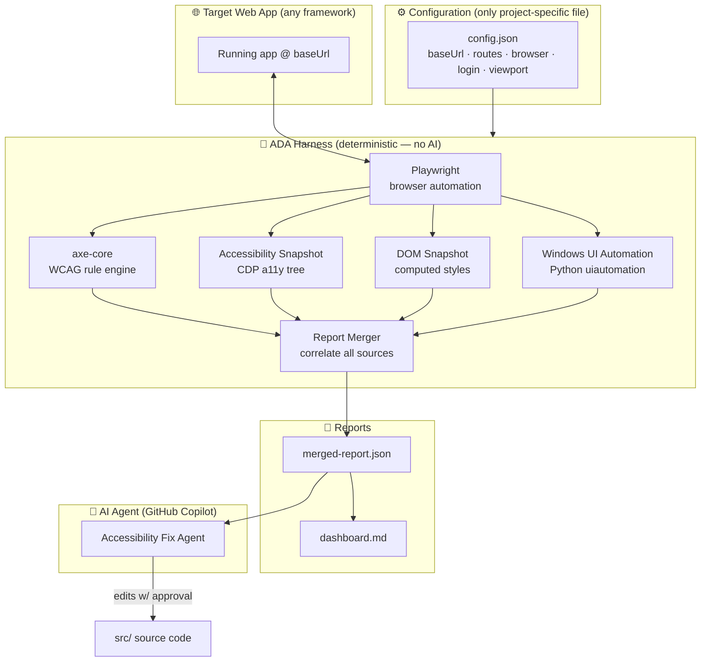

---

## 2. Scan Workflow (`npm run ada`)

The orchestrator [`analyze.ts`](scripts/analyze.ts) runs four technologies, then
summarizes and merges.


Mermaid source

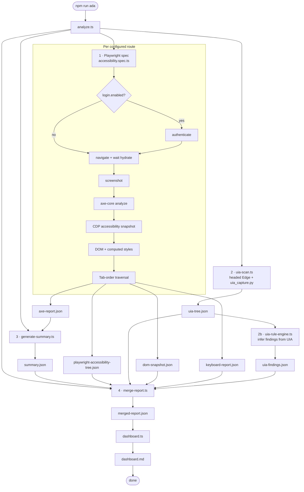

**Which technology writes what**

| Stage | Script | Output |
| --- | --- | --- |
| Playwright + axe-core | `accessibility.spec.ts` | `axe-report.json` |
| Accessibility Snapshot | `accessibility.spec.ts` (CDP) | `playwright-accessibility-tree.json` |
| DOM Snapshot | `accessibility.spec.ts` | `dom-snapshot.json` |
| Keyboard / Tab-order | `accessibility.spec.ts` | `keyboard-report.json` |
| Windows UI Automation | `uia-scan.ts` → `uia_capture.py` | `uia-tree.json` |
| UIA Rule Engine | `uia-rule-engine.ts` | `uia-findings.json` |
| Summarize | `generate-summary.ts` | `summary.json` |
| Correlate | `merge-report.ts` | `merged-report.json` |
| Dashboard | `dashboard.ts` | `dashboard.md` |

---

## 3. Fix + Revalidate Workflow (AI agent)

Remediation is driven by the **Accessibility Fix Agent** (GitHub Copilot Agent
Mode) — there is no deterministic auto-fix command. The developer scans, the
agent fixes **every** gap in `src/`, then the developer re-scans and compares.


Mermaid source

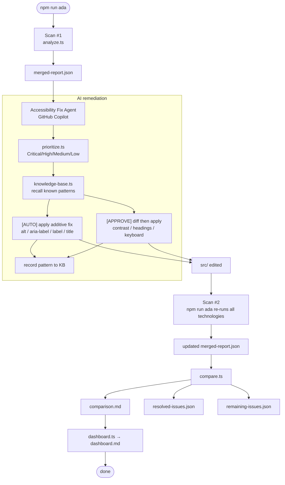

**Two-tier remediation (the agent's decision boundary)**

| [AUTO] — applied directly (safe, additive) | [APPROVE] — diff then apply (needs judgment) |
| --- | --- |
| `image-alt`, `input-image-alt` | `color-contrast` |
| `button-name`, `link-name`, `select-name` | `heading-order`, `page-has-heading-one` |
| `label`, `aria-input-field-name` | keyboard / focus management |
| `frame-title`, `html-has-lang` | landmark / region structure |

---

## 4. Sequence View (end to end)

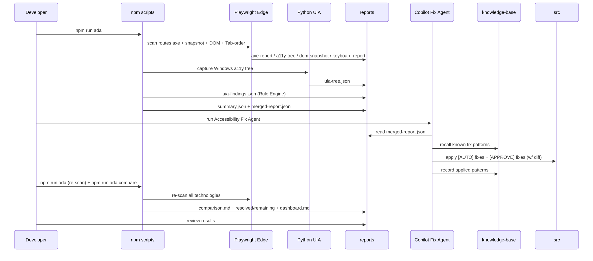

Mermaid source

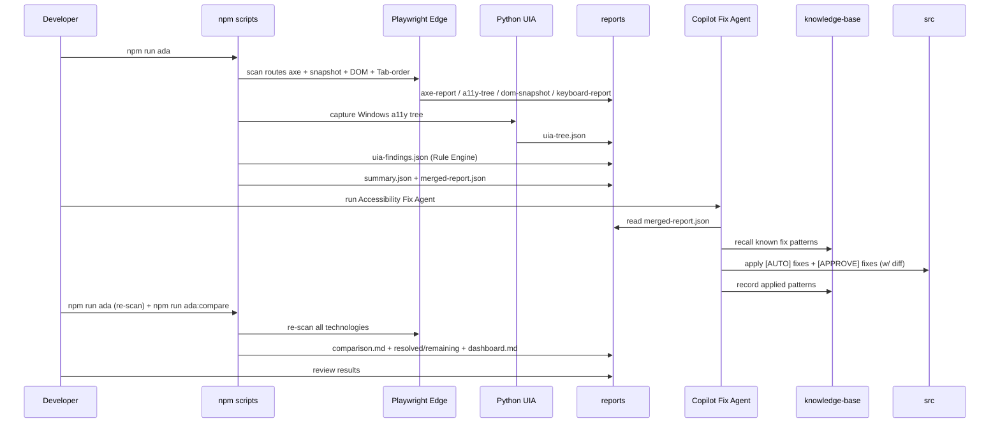

---

## 5. Data Flow (artifacts)


Mermaid source

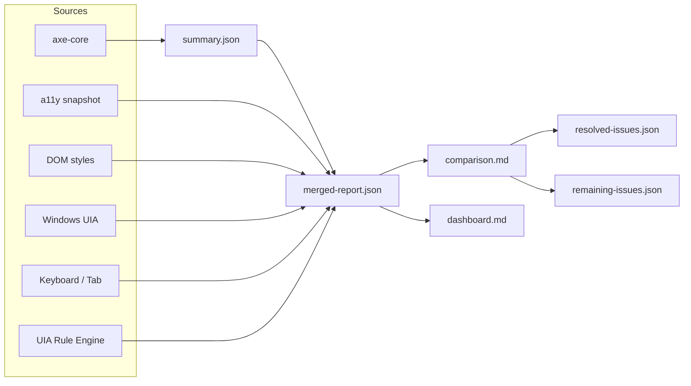

---

## 6. Where AI fits


Mermaid source

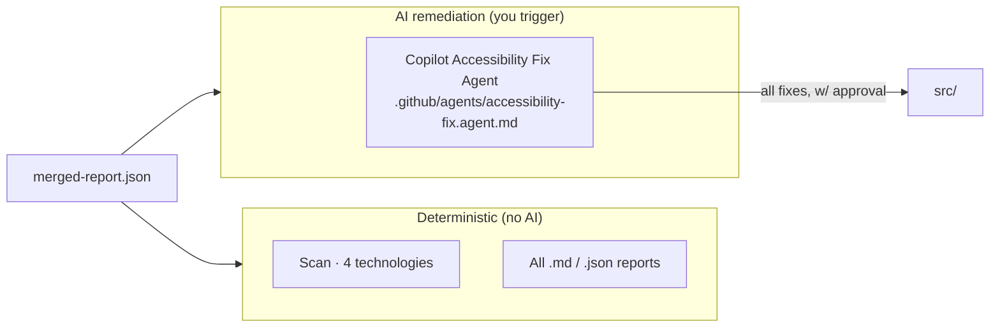

- **Scanning and reports are 100% deterministic** — no AI, fully repeatable.
- **All remediation is done by the AI agent**: the single Copilot agent resolves
  every gap (additive labels **and** nuanced fixes like contrast / headings /
  keyboard) with your approval, using the same `merged-report.json`.

---

## Quick reference

| Command | Does |
| --- | --- |
| `npm run ada` | Scan (4 technologies) → merge → dashboard |
| `npm run uia` | Windows UI Automation capture only |
| `npm run merge` | Rebuild `merged-report.json` |
| `npm run compare` | Write `comparison.md` (resolved / remaining / new + score) |
| `npm run dashboard` | Rebuild `dashboard.md` |

> Remediation is performed by the **Accessibility Fix Agent** (Copilot Agent Mode),
> not a command — scan, let the agent fix every gap, then re-scan and compare.

> Mermaid diagrams render automatically in VS Code's Markdown preview
> (`Ctrl+Shift+V`) and on GitHub.
