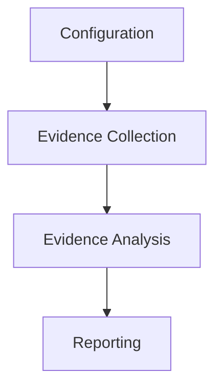
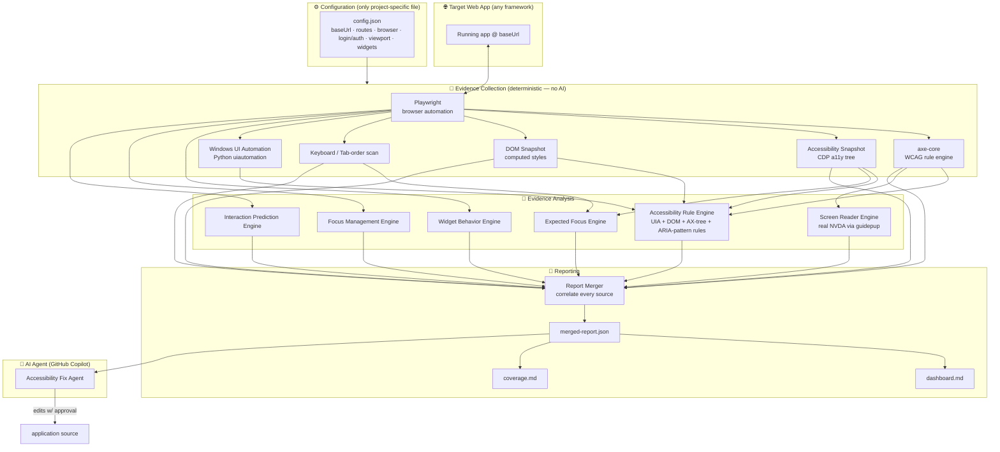
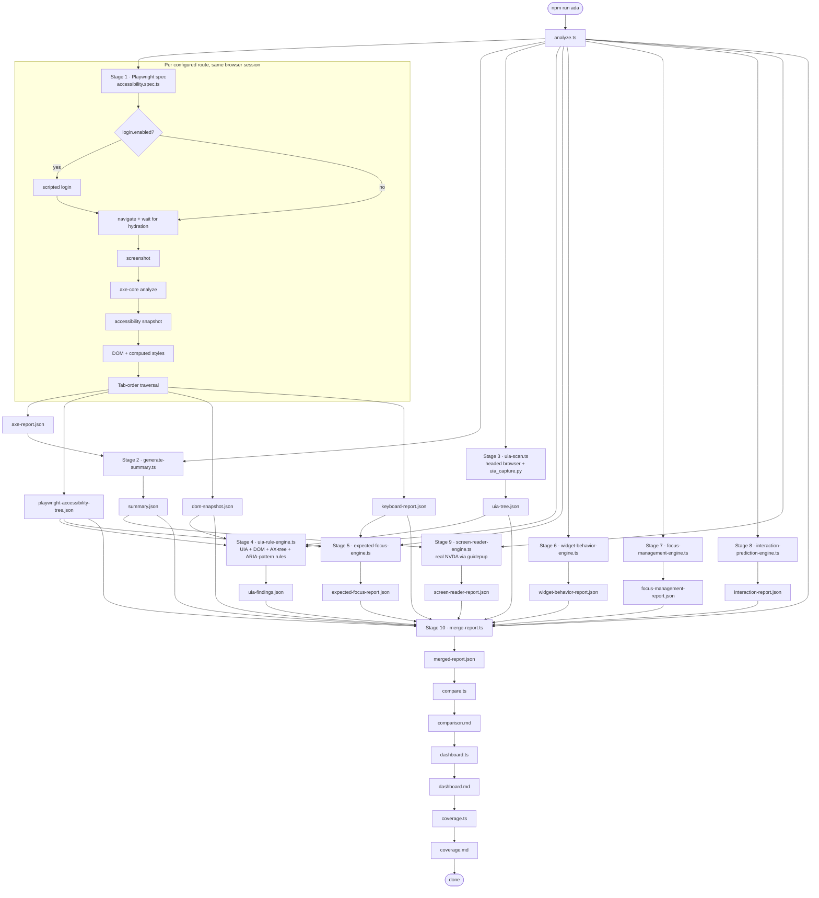
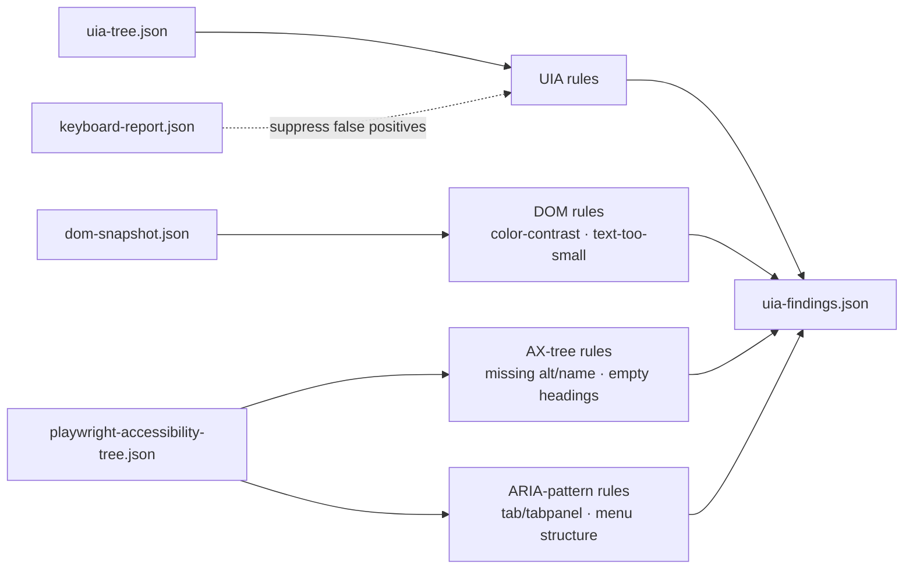
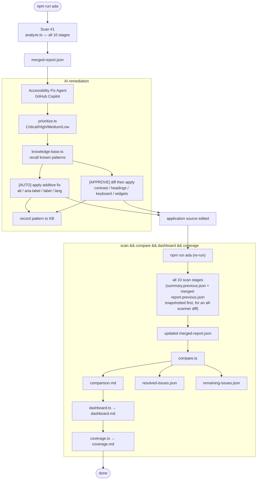
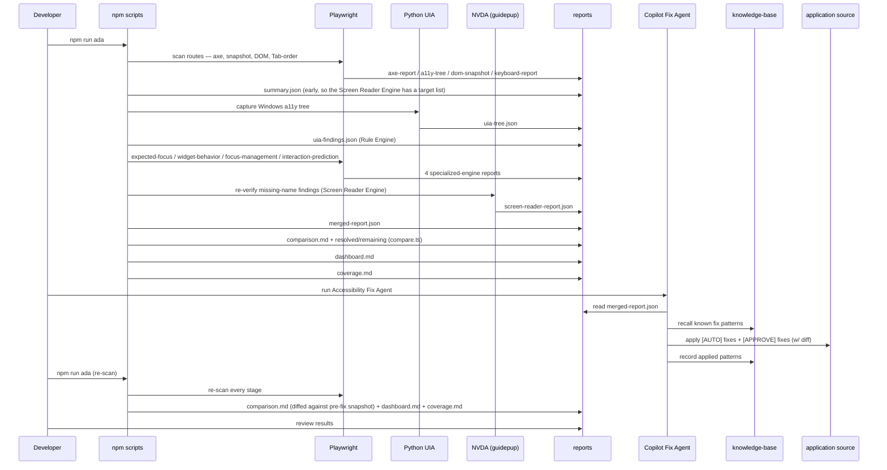
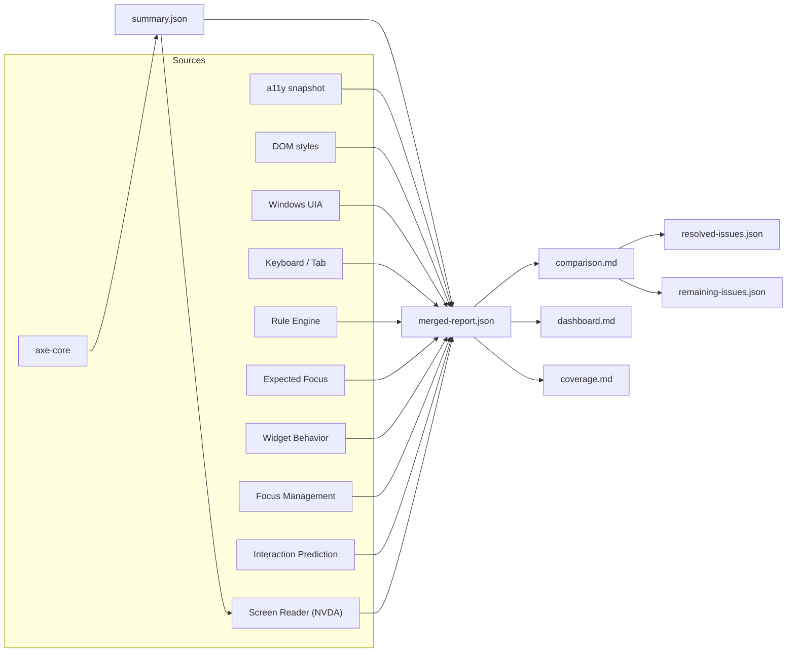
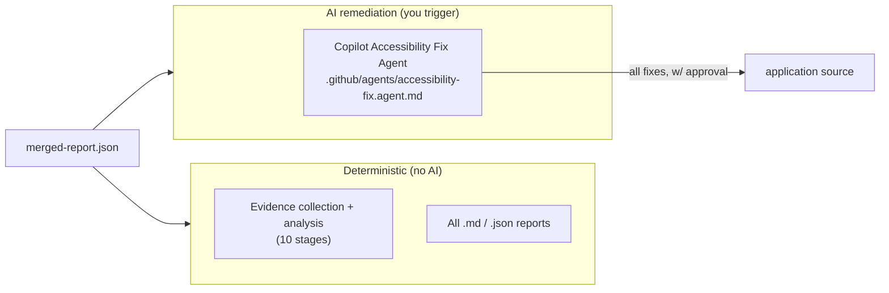

# ADA Harness — Architecture & Workflow

Visual guide to how the harness and agent work. All diagrams reflect the actual
scripts in [`scripts/`](scripts), the spec in [`playwright/`](playwright), and the
config in [`config.json`](config.json).

> Diagrams below are plain Mermaid code fences, which GitHub and VS Code's Markdown
> preview (`Ctrl+Shift+V`) render automatically — no separate image file to keep in
> sync with the source.

---

## Think of it as a factory: four departments, nothing skipped

- **Configuration** (`config.json`) answers *what should I scan* — base URL, routes,
  browser, WCAG rules, auth strategy. Nothing is tested here; it's the scan blueprint.
- **Evidence Collection** (Playwright + Windows UIA) gathers raw facts: the axe-core
  report, the accessibility tree, the DOM + computed styles, the keyboard Tab order, and
  the Windows accessibility tree.
- **Evidence Analysis** (the Accessibility Rule Engine + five specialized engines)
  interprets that evidence — turning raw facts into findings with a WCAG citation and a
  recommendation.
- **Reporting** correlates every finding into one confidence-scored report and produces
  the dashboard, comparison, and fix suggestions developers actually read.

This separation is what makes the harness modular: a new rule or a new specialized
engine can be added later without touching the core scanning pipeline.

---

## 1. High-level Architecture

---

## 2. Scan Workflow (`npm run ada`)

`npm run ada` runs [`analyze.ts`](scripts/analyze.ts)'s ten-stage scan, then
`compare.ts`, `dashboard.ts`, and `coverage.ts` in that order (`npm run scan &&
npm run compare && npm run dashboard && npm run coverage`) — nothing skips a
stage, though stages 5–9 (the specialized engines) are individually optional and
degrade gracefully if one fails, so a single engine's failure never blocks the
report.

**Which stage writes what**

| Stage | Script | Output |
| --- | --- | --- |
| 1 · Playwright + axe-core | `accessibility.spec.ts` | `axe-report.json` |
| 1 · Accessibility Snapshot | `accessibility.spec.ts` (CDP) | `playwright-accessibility-tree.json` |
| 1 · DOM Snapshot | `accessibility.spec.ts` | `dom-snapshot.json` |
| 1 · Keyboard / Tab-order | `accessibility.spec.ts` | `keyboard-report.json` |
| 2 · Summarize | `generate-summary.ts` | `summary.json` |
| 3 · Windows UI Automation | `uia-scan.ts` → `uia_capture.py` | `uia-tree.json` |
| 4 · Accessibility Rule Engine | `uia-rule-engine.ts` (`accessibility-rule-engine/`) | `uia-findings.json` |
| 5 · Expected Focus Engine | `expected-focus-engine.ts` | `expected-focus-report.json` |
| 6 · Widget Behavior Engine | `widget-behavior-engine.ts` | `widget-behavior-report.json` |
| 7 · Focus Management Engine | `focus-management-engine.ts` | `focus-management-report.json` |
| 8 · Interaction Prediction Engine | `interaction-prediction-engine.ts` | `interaction-report.json` |
| 9 · Screen Reader Engine | `screen-reader-engine.ts` | `screen-reader-report.json` |
| 10 · Correlate | `merge-report.ts` | `merged-report.json` |
| Compare | `compare.ts` | `comparison.md` |
| Dashboard | `dashboard.ts` | `dashboard.md` |
| Coverage | `coverage.ts` | `coverage.md` |

`generate-summary.ts` runs right after the Playwright spec (stage 2, not last)
specifically so the Screen Reader Engine at stage 9 has a target list of
missing-name violations to re-verify.

Stages 6–8 (and the UIA capture in stage 3) share one navigation helper,
[`scripts/navigate.ts`](scripts/navigate.ts): a plain `page.goto()` per route by
default (`navigation.mode: "reload"`, correct for any application), or opt-in
same-document SPA navigation (`navigation.mode: "spa"`) for apps with a real
client-side router.

---

## 3. The Accessibility Rule Engine (Stage 4)

`uia-rule-engine.ts` evaluates four independent rule sets over whatever evidence is
available — each one degrades gracefully if its source artifact is missing:

DOM and AX-tree rules run on every host OS; only the UIA rule set is Windows-only and
reports `available: false` elsewhere so the rest of the pipeline is unaffected.

---

## 4. Fix + Revalidate Workflow (AI agent)

Remediation is driven by the **Accessibility Fix Agent** (GitHub Copilot Agent
Mode) — there is no deterministic auto-fix command for the full workflow. A
narrower, non-interactive `npm run auto-fix` also exists for the safe-fix subset
only (see below); it's report-only by default and never touches source unless
explicitly told to. The developer
scans, the agent fixes selected gaps in the app source, then the developer re-runs
`npm run ada`, which scans, compares against the pre-fix snapshot, and rebuilds the
dashboard in one command.

**Two-tier remediation (the agent's decision boundary)**

`auto-fix.ts`'s `SAFE_RULES` set defines the [AUTO] boundary exactly — everything else
is [APPROVE]. Note this table describes the Accessibility Fix Agent's own judgment
boundary, not `npm run auto-fix`'s default behavior — that script reports every rule,
[AUTO] or [APPROVE], as a suggestion unless `autoFix.applyFixes: true` or `--apply` is
set, and even then only within [AUTO] rules that resolve to exactly one unambiguous
source element project-wide:

| [AUTO] — additive, no judgment required | [APPROVE] — diff then apply (needs judgment) |
| --- | --- |
| `image-alt`, `input-image-alt` | `color-contrast` |
| `button-name`, `input-button-name`, `link-name`, `select-name` | `heading-order`, `page-has-heading-one` |
| `aria-command-name`, `aria-toggle-field-name` | keyboard / focus management findings |
| `label`, `aria-input-field-name` | widget behavior / interaction findings |
| `frame-title`, `html-has-lang` | landmark structure |

---

## 5. Sequence View (end to end)

---

## 6. Data Flow (artifacts)

---

## 7. Where AI fits

- **Evidence collection and analysis are 100% deterministic** — no AI, fully repeatable,
  identical output for identical input.
- **All remediation is done by the AI agent**: the single Copilot agent resolves every
  gap (additive labels **and** nuanced fixes like contrast, headings, keyboard, and
  widget behavior) with your approval, using the same `merged-report.json`.

---

## Quick reference

| Command | Does |
| --- | --- |
| `npm run ada` | Full 10-stage scan → `compare` → `dashboard` → `coverage` — the one command that leaves every report fresh |
| `npm run scan` | The 10-stage scan only (no compare/dashboard/coverage regeneration) |
| `npm run summary` | Rebuild `summary.json` from the existing raw axe report (snapshots the prior one first) |
| `npm run uia` | Windows UI Automation capture only |
| `npm run uia:rules` | Rebuild `uia-findings.json` from existing artifacts |
| `npm run screen-reader` | Re-verify missing-name findings against real NVDA (Screen Reader Engine) only |
| `npm run merge` | Rebuild `merged-report.json` |
| `npm run compare` | Write `comparison.md` (resolved / remaining / new + score) — already included in `npm run ada`; run it standalone only to re-diff without a full re-scan |
| `npm run dashboard` | Rebuild `dashboard.md` |
| `npm run coverage` | Rebuild `coverage.md` (WCAG 2.2 A/AA success-criterion coverage) |
| `npm run auto-fix` | Report-only pass over axe findings (`fixes.json` / `fixes.md`) — never edits source |
| `npm run auto-fix:apply` | Same, but writes the unambiguous [AUTO] fixes to source (equivalent to `autoFix.applyFixes: true`) |
| `npm run save-auth` | Capture an interactive login session to `auth/session.json` |

> Full interactive remediation (explain → plan → fix → revalidate) is performed by the
> **Accessibility Fix Agent** (Copilot Agent Mode) — `npm run auto-fix` only covers the
> deterministic, axe-only safe-fix subset, and only writes to source when explicitly
> told to.

> Mermaid diagrams render automatically in VS Code's Markdown preview
> (`Ctrl+Shift+V`) and on GitHub.
