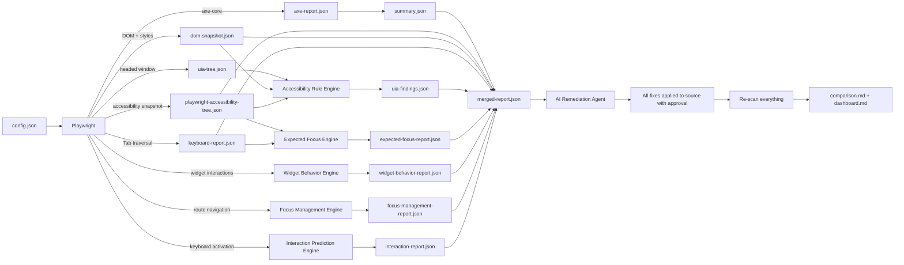
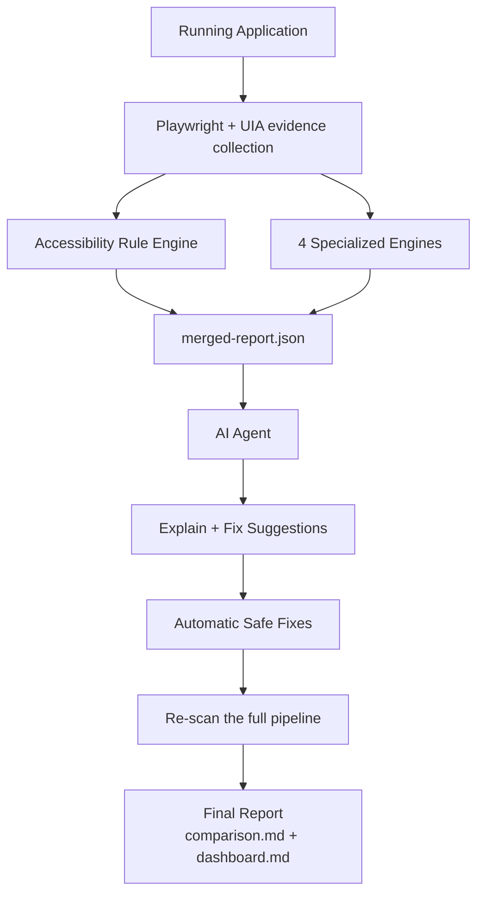

# ADA Harness & AI-Based Accessibility Remediation Agent

A reusable, framework-independent, enterprise-level accessibility toolkit that
**collects evidence** from any running web application across Playwright (axe-core,
accessibility tree, DOM snapshot, keyboard traversal) and Windows UI Automation,
**analyzes** that evidence with a rule engine plus four specialized behavioral engines,
**merges** every finding into one correlated report, and **remediates** issues with an AI
agent that explains each problem, locates the affected source code, and applies **safe**
automatic fixes.

Nothing about the target application is hardcoded — routes, selectors, auth strategy,
navigation style, and source-file layout are all driven by [`config.json`](config.json),
so the same harness works unmodified across projects and frameworks.

---

## Objective

This project is made up of **two independent but integrated components**:

| # | Component | Responsibility |
| - | --------- | -------------- |
| 1 | **ADA Harness** | Scans a running web application using **Playwright**, **axe-core**, the **Playwright Accessibility Snapshot**, and **Windows UI Automation**, then merges all findings into `merged-report.json`. |
| 2 | **AI Accessibility Remediation Agent** | Reads `merged-report.json`, identifies the affected source files/components, explains every violation, and generates **safe** code fixes. Unsafe fixes are left for developer review. |

Both modules can be used **together** (scan → merge → fix → re-scan → compare) or
**independently** (scan-only for auditing, or agent-only against a pre-existing report).

> **Key principle:** The harness is **not hardcoded** to any particular application. The
> only project-specific inputs live in **`config.json`** (base URL, routes, login, etc.).
> Everything else works automatically, and the AI agent dynamically analyzes whatever the
> merged report contains — so the **same harness and agent are reusable across any project**
> without changing the core implementation.

---

## Architecture & Technologies

> 📊 For full diagrams (architecture, scan workflow, fix workflow, sequence, and data flow)
> see [ARCHITECTURE.md](ARCHITECTURE.md).

The harness runs the full pipeline — evidence collection, rule evaluation, and four
specialized behavioral engines — on every scan:

| # | Technology | Role in the pipeline | Artifact |
| - | ---------- | -------------------- | -------- |
| 1 | **Playwright** | Launches the browser, performs optional login, navigates every configured route, captures screenshots. | (drives all stages) |
| 2 | **axe-core** | WCAG 2.1 AA rule checking, violation detection, severity. | `axe-report.json` → `summary.json` |
| 3 | **Playwright Accessibility Snapshot** | Captures the browser accessibility tree (roles, accessible names, hierarchy, focusability). | `playwright-accessibility-tree.json` |
| 4 | **Windows UI Automation (UIA)** | Validates what Windows Assistive Technologies actually receive by walking the Windows accessibility tree of the live browser window. | `uia-tree.json` |
| 5 | **Full DOM Snapshot** | Captures the serialized DOM + computed style properties (colour, background, font) so visual rules like `color-contrast` can be verified against real DOM facts the accessibility trees cannot expose. | `dom-snapshot.json` |
| 6 | **Keyboard / Tab-order scan** | Simulates a keyboard-only user (presses Tab) to find interactive controls that cannot be reached — WCAG 2.1.1 / 2.4.3. | `keyboard-report.json` |
| 7 | **Accessibility Rule Engine** | Evaluates four rule sets over the collected evidence — UIA rules, DOM rules (contrast, text size), AX-tree rules (missing names, empty headings), and whole-page ARIA-pattern rules (tab/tabpanel, menu structure). | `uia-findings.json` |
| 8 | **Expected Focus Engine** | Compares elements that *should* receive keyboard focus (from the accessibility tree) against what the Tab traversal actually reached. | `expected-focus-report.json` |
| 9 | **Widget Behavior Engine** | Drives real keyboard interactions against WAI-ARIA widget patterns (tabs, menus, accordions, dialogs, comboboxes) to verify they behave per the APG, not just that the markup looks right. | `widget-behavior-report.json` |
| 10 | **Focus Management Engine** | Checks where focus lands after route navigation, sweeps every reachable element for a real visible focus indicator, and verifies focus returns to a dialog's trigger after it closes. | `focus-management-report.json` |
| 11 | **Interaction Prediction Engine** | Tests custom (non-native) interactive elements — `role="button"`, custom checkboxes/switches/tabs — to confirm Enter/Space actually activate them. | `interaction-report.json` |
| ★ | **Report merger** | Correlates every scanner and engine so each finding shows *who detected it*, *where it was confirmed*, and a **confidence** score. | `merged-report.json` |



---

## Features

### ADA Harness

- Automated accessibility scanning across multiple technologies
- Playwright integration (browser automation, login, navigation, screenshots)
- axe-core integration (industry-standard rule engine)
- **Playwright Accessibility Snapshot** (browser accessibility tree capture)
- **Windows UI Automation** capture (what Windows AT actually receives)
- **Full DOM snapshot** with computed styles (verifies visual rules like contrast)
- **Keyboard / Tab-order scan** (finds controls unreachable by Tab — WCAG 2.1.1)
- **Accessibility Rule Engine** — UIA rules, DOM rules, AX-tree rules, and whole-page
  ARIA-pattern rules, turning raw evidence into meaningful findings
- **Expected Focus Engine** — expected vs. actual keyboard focus comparison
- **Widget Behavior Engine** — drives real keyboard interactions against ARIA widget
  patterns (tabs, menus, accordions, dialogs, comboboxes) via a config-driven selector set
- **Focus Management Engine** — focus-after-navigation, a full-page `:focus-visible`
  sweep, and dialog focus-restoration checks
- **Interaction Prediction Engine** — verifies custom interactive elements actually
  respond to Enter/Space
- **Merged report** correlating every scanner and engine with a confidence score
  (`merged-report.json`)
- WCAG 2.0 / 2.1 **A & AA** validation + axe best-practice rules
- JSON report generation (raw axe output + flattened summary + trees + merged)
- Markdown summary + dashboard generation
- Multi-page scanning in a single run, with a configurable navigation strategy
  (full reload — works everywhere — or opt-in same-document SPA navigation)
- Fully configurable routes, login/auth, viewport, browser, widget selectors, timeouts,
  ignored rules
- Framework independent (works with any URL that renders in a browser; no
  framework-specific code is required to get useful results)

### AI Remediation Agent

- Reads the correlated **`merged-report.json`**
- Explains every violation in plain language
- Maps each violation to the affected source file **and component**
- Reports which scanner detected it and where it was confirmed
- Prioritizes issues (Critical / High / Medium / Low)
- Applies **[AUTO]** fixes directly and **[APPROVE]** fixes (contrast, headings, keyboard) with an approved diff
- Resolves **every** gap in source — axe, keyboard, UIA rule engine, and all four
  specialized engines (expected focus, widget behavior, focus management, interaction
  prediction)
- Learns resolved patterns via a project-independent knowledge base
- Re-runs the full scan after fixes and generates a before/after comparison

---

## Folder Structure

```text
ADA Harness/
├── config.json                  # ⭐ THE ONLY project-specific file (baseUrl, routes, auth, …)
├── config.schema.json           # JSON Schema for config.json (editor validation/autocomplete)
├── agent/                       # Continuous-learning knowledge base
│   └── knowledge-base.json      # Project-independent record of resolved fix patterns
├── auth/                        # Saved login session (git-ignored; created by `npm run save-auth`)
│   └── session.json             # Playwright storageState — cookies + localStorage
├── playwright/                  # Playwright config + the scan spec
│   ├── config.ts                # Loads config.json; exports adaConfig + Playwright config
│   └── accessibility.spec.ts    # axe-core scan + accessibility snapshot + DOM + keyboard
├── uia/                         # Windows UI Automation capture (Technology 4)
│   ├── uia_capture.py           # Python UIA walker (reads the Windows a11y tree)
│   └── requirements.txt         # Python dependency: uiautomation
├── reports/                     # All generated artifacts (created/updated on each run)
│   ├── axe-report.json                    # Raw, complete axe-core results
│   ├── summary.json                       # Flattened, per-element violation summary
│   ├── summary.previous.json              # Snapshot of the prior axe-only summary
│   ├── playwright-accessibility-tree.json # Playwright accessibility snapshot
│   ├── uia-tree.json                      # Windows UI Automation tree
│   ├── uia-findings.json                  # Accessibility Rule Engine findings
│   ├── dom-snapshot.json                  # Full DOM + computed styles
│   ├── keyboard-report.json               # Tab-order traversal + keyboard gaps
│   ├── expected-focus-report.json         # Expected Focus Engine findings
│   ├── widget-behavior-report.json        # Widget Behavior Engine findings
│   ├── focus-management-report.json       # Focus Management Engine findings
│   ├── interaction-report.json            # Interaction Prediction Engine findings
│   ├── merged-report.json                 # Correlated, cross-scanner report (agent input)
│   ├── merged-report.previous.json        # Snapshot of the prior merged report (all-scanner diffing)
│   ├── comparison.md                      # Before/after Markdown comparison (all scanners)
│   ├── dashboard.md                       # Human-readable Markdown dashboard
│   ├── fixes.json / fixes.md              # axe findings only: applied/suggested/skipped (report-only by default)
│   ├── resolved-issues.json               # Resolved issues (after re-scan)
│   ├── remaining-issues.json              # Remaining + newly introduced issues
│   └── screenshots/                       # Per-page screenshots (optional)
├── scripts/                     # TypeScript pipeline (executed with tsx)
│   ├── analyze.ts                    # Orchestrates all 9 stages, in order
│   ├── navigate.ts                   # Shared, config-driven multi-page navigation helper
│   ├── generate-summary.ts           # Flattens axe-report.json into summary.json
│   ├── uia-scan.ts                   # Drives a headed browser + runs uia_capture.py
│   ├── uia-rule-engine.ts            # Runs the Accessibility Rule Engine
│   ├── accessibility-rule-engine/    # Modular, Open/Closed accessibility rules
│   │   ├── types.ts                  # Rule/finding contracts
│   │   ├── engine.ts                 # Evaluator across all sources
│   │   ├── uia-parser.ts             # UIA tree parsing helpers
│   │   ├── index.ts                  # Public exports
│   │   └── rules/
│   │       ├── uia-rules.ts          # Raw UIA property findings
│   │       ├── dom-rules.ts          # Color-contrast, text-too-small
│   │       ├── ax-tree-rules.ts      # Missing alt/name, empty headings
│   │       ├── aria-pattern-rules.ts # Whole-page ARIA widget structure
│   │       └── index.ts              # Combined rule registry
│   ├── expected-focus-engine.ts      # Expected vs. actual Tab-order comparison
│   ├── widget-behavior-engine.ts     # WAI-ARIA widget interaction tests
│   ├── focus-management-engine.ts    # Focus-after-nav + focus-visible sweep + modal restoration
│   ├── interaction-prediction-engine.ts # Custom-element keyboard activation tests
│   ├── merge-report.ts               # Correlates every scanner/engine → merged-report.json
│   │                                  #   (also snapshots merged-report.previous.json)
│   ├── all-findings.ts               # Shared all-7-scanner normalizer (dashboard.ts + compare.ts)
│   ├── auto-fix.ts                   # Report-only by default; --apply / autoFix.applyFixes writes safe fixes
│   ├── prioritize.ts                 # Critical/High/Medium/Low prioritization
│   ├── knowledge-base.ts             # Continuous-learning store
│   ├── save-auth.ts                  # Interactive login capture → auth/session.json
│   ├── compare.ts                    # Diffs current vs previous (all scanners) → comparison.md
│   ├── dashboard.ts                  # Renders dashboard.md (all scanners + coverage)
│   ├── score.ts                      # Computes accessibility score / severity totals
│   ├── logger.ts                     # Small structured console logger
│   └── types.ts                      # Shared TypeScript contracts for all artifacts
├── package.json                 # Scripts & dev dependencies
└── tsconfig.json                # TypeScript compiler configuration
```

### Directory purpose

| Directory / File | Purpose |
| ---------------- | ------- |
| `config.json` | **The only file you normally edit.** All project-specific inputs: baseUrl, browser, viewport, routes, login/auth, widget selectors, navigation mode, screenshots, ignored routes/rules, timeouts, report directory, auto-fix file layout. |
| `config.schema.json` | JSON Schema for `config.json` — gives editors real validation and autocomplete. |
| `agent/knowledge-base.json` | Project-independent knowledge base of resolved fix patterns (continuous learning). |
| `auth/session.json` | Saved authenticated browser session, produced by `npm run save-auth`. Optional — only needed when `login.enabled` scripted login isn't sufficient (SSO, MFA, CAPTCHA). |
| The AI agent | Defined at [`.github/agents/accessibility-fix.agent.md`](../.github/agents/accessibility-fix.agent.md) (VS Code Copilot Agent Mode). |
| `playwright/config.ts` | Loads `config.json`, resolves all artifact paths, and exports both `adaConfig` and the Playwright configuration. Not normally edited. |
| `playwright/accessibility.spec.ts` | The main scan — login, navigation, axe-core, accessibility snapshot, DOM snapshot, keyboard traversal. |
| `uia/` | Windows UI Automation capture: a Python script that walks the Windows accessibility tree of the live browser window. |
| `reports/` | Every artifact the harness produces. Safe to delete; regenerated on each run. |
| `scripts/` | The TypeScript pipeline that orchestrates scanning, UIA capture, rule evaluation, the specialized engines, merging, comparing, and reporting. |
| `scripts/navigate.ts` | The single, config-driven place that decides how the specialized engines move between pages — full reload (default, works everywhere) or opt-in SPA navigation. |
| `package.json` | Defines the `ada`, `scan`, `summary`, `uia`, `uia:rules`, `merge`, `compare`, `dashboard`, `auto-fix`, `auto-fix:apply`, and `save-auth` entry points, plus dev dependencies. |
| `tsconfig.json` | Strict TypeScript configuration for the scripts and spec. |

---

## Prerequisites

| Software | Purpose | Notes |
| -------- | ------- | ----- |
| **Node.js** (v18+) | Runtime for the harness and scripts | LTS recommended |
| **npm** | Package manager | Ships with Node.js |
| **VS Code** | Editor + host for the AI agent | Recommended |
| **GitHub Copilot (Agent Mode)** | Runs the AI remediation agent | Required for AI-driven fixes |
| **Playwright** | Browser automation | Installed via npm + `npx playwright install` |
| **axe-core** | Accessibility rule engine | Installed via npm (`@axe-core/playwright`) |
| **Python** (3.8+) | Runs the Windows UI Automation capture | Required for Technology 4 (UIA) |
| **`uiautomation`** (Python pkg) | Reads the Windows accessibility tree | `pip install -r uia/requirements.txt` (Windows only) |

> **Windows UI Automation is Windows-only.** On non-Windows hosts (or when `uiautomation`
> is not installed) the UIA stage still executes and still writes `uia-tree.json`, but it
> records `available: false` so the merge step and the rest of the pipeline continue to work.

---

## Installation

```bash
# 1. Clone the repository that contains the harness
git clone <your-repository-url>

# 2. Move into the harness package
cd "ADA Harness"

# 3. Install dependencies (Playwright, axe-core, tsx, TypeScript, etc.)
npm install

# 4. Download the browser binaries Playwright drives
npx playwright install

# 5. Install the Windows UI Automation dependency (Windows only)
pip install -r uia/requirements.txt
```

**Command explanations**

| Command | What it does |
| ------- | ------------ |
| `git clone <url>` | Downloads the project source to your machine. |
| `cd "ADA Harness"` | Enters the harness package directory. |
| `npm install` | Installs all dependencies listed in `package.json`. |
| `npx playwright install` | Downloads the Chromium/Firefox/WebKit binaries Playwright needs to launch real browsers. |
| `pip install -r uia/requirements.txt` | Installs the `uiautomation` package used by the Windows UI Automation stage. |

---

## Configuration

All project-specific configuration lives in a **single file** —
[`config.json`](config.json). There are **no hardcoded application values** anywhere in the
source. To point the harness at a different application, edit only this file.

```jsonc
{
  "$schema": "./config.schema.json",
  "baseUrl": "http://localhost:3000",   // running app URL (override with ADA_BASE_URL)
  "browser": "chromium",                // chromium | firefox | webkit
  "viewport": { "width": 1280, "height": 800 },
  "settleTimeoutMs": 1500,               // wait for hydration before scanning
  "timeouts": { "navigationMs": 30000, "testMs": 60000 },
  "appSrcDir": "../src",                 // source root the agent fixes
  "reportDir": "reports",               // output folder
  "screenshots": { "enabled": true, "dir": "reports/screenshots" },
  "wcagTags": ["wcag2a", "wcag2aa", "wcag21a", "wcag21aa", "best-practice"],
  "ignoredRules": [],                    // axe rule ids to disable
  "routes": [
    { "name": "Home",  "path": "/" },
    { "name": "Login", "path": "/login" }
    // ...add or remove routes here
  ],
  "ignoredRoutes": [],                   // route paths to skip
  "login": {
    "enabled": false,
    "loginPath": "/login",
    "usernameSelector": "#email",
    "passwordSelector": "#password",
    "submitSelector": "button[type=\"submit\"]",
    "usernameEnv": "ADA_LOGIN_USER",     // credentials come from ENV, never hardcoded
    "passwordEnv": "ADA_LOGIN_PASS",
    "waitForSelector": ""
  },
  "uia": {
    "enabled": true,
    "python": "python",
    "maxDepth": 40,
    "windowClass": "Chrome_WidgetWin_1"
  },
  "navigation": { "mode": "reload" },    // "reload" (default, any app) | "spa" (opt-in)
  "widgets": { "accordionSelector": "details > summary, [role=\"button\"][aria-expanded]" },
  "auth": { "enabled": false, "manualLoginTimeoutMs": 300000, "readySelector": "" },
  "autoFix": {
    "sourceExtensions": [".tsx", ".ts", ".jsx", ".js", ".vue", ".html"],
    "htmlEntryPoints": ["public/index.html", "src/index.html", "index.html"]
  }
}
```

| What you configure | Key | Notes |
| ------------------ | --- | ----- |
| **Base URL** | `baseUrl` | Or set `ADA_BASE_URL` env var (wins over config). |
| **Browser** | `browser` | `chromium` \| `firefox` \| `webkit`. |
| **Viewport** | `viewport` | `{ width, height }`. |
| **Application routes** | `routes` | Array of `{ name, path }`. |
| **Ignored routes** | `ignoredRoutes` | Route paths removed before scanning. |
| **Ignored WCAG rules** | `ignoredRules` | axe rule ids disabled during the scan. |
| **Scripted login** | `login` | See [How to Configure Login](#how-to-configure-login). |
| **Interactive/SSO auth** | `auth` | See [How to Configure Interactive Authentication](#how-to-configure-interactive-authentication). |
| **Multi-page navigation** | `navigation.mode` | `"reload"` (default) or `"spa"` — see [How to Extend](#how-to-extend). |
| **Widget selectors** | `widgets.accordionSelector` | Selector the Widget Behavior Engine uses to find accordion headers. |
| **Auto-fix file layout** | `autoFix` | `sourceExtensions` + `htmlEntryPoints`, so the fixer works with any project layout. |
| **Screenshots** | `screenshots` | Toggle + output directory. |
| **Report directory** | `reportDir` | Where all artifacts are written. |
| **Source root** | `appSrcDir` | The code the agent applies fixes to. |
| **Timeouts** | `timeouts` | Navigation + per-test timeouts. |

> **Environment overrides:** `ADA_BASE_URL` and `ADA_SETTLE_MS` let CI point the same
> harness at staging/preview deployments without editing `config.json`.
>
> **Editor validation:** `config.json`'s `$schema` points at the bundled
> [`config.schema.json`](config.schema.json), so editors with JSON Schema support (VS Code
> included) give you autocomplete and inline validation while editing.

### How to Configure Login

Set `login.enabled` to `true` and provide the selectors for your login form. **Credentials
are never stored in `config.json`** — they are read from the environment variables named by
`usernameEnv` / `passwordEnv`:

```bash
# PowerShell
$env:ADA_LOGIN_USER = "tester@example.com"
$env:ADA_LOGIN_PASS = "<password>"
npm run ada
```

The login flow runs once before any protected route is scanned. This works for simple
username/password forms with known, stable selectors.

### How to Configure Interactive Authentication

Some applications can't be logged into with a scripted `login` block — SSO, ADFS, OAuth,
MFA, CAPTCHA, or anything requiring a human in the loop. For those, run:

```bash
npm run save-auth
```

This opens a real, headed browser at `baseUrl`. Log in by hand; the script then saves the
authenticated session (cookies + localStorage) to `auth/session.json`. The Widget Behavior,
Focus Management, and Interaction Prediction engines automatically reuse that session on
every subsequent run — nothing else to configure. Two optional `auth` settings make the
capture unattended-friendly:

| Key | Purpose |
| --- | ------- |
| `auth.readySelector` | A CSS selector that only exists once login succeeds (e.g. a dashboard element). When set, `save-auth` waits for it automatically instead of a manual keypress. |
| `auth.manualLoginTimeoutMs` | How long to wait for login to complete (default 5 minutes). |

Delete `auth/session.json` and re-run `npm run save-auth` whenever the session expires.

---

## How to Test Any Project

The harness works for **any** web application. Follow this workflow:

### Step 1 — Clone the ADA Harness

```bash
git clone <your-repository-url>
cd "ADA Harness"
npm install
npx playwright install
```

*Expected output:* dependencies installed and browser binaries downloaded.

### Step 2 — Update configuration

Edit [`config.json`](config.json) and set `baseUrl` and `routes` for your application
(plus `login`, `browser`, `viewport`, etc. as needed).

*Expected output:* config now points at your app's URL and routes.

### Step 3 — Start the target application

Start your app so it is reachable at the configured `baseUrl` (for example
`http://localhost:3000`).

*Expected output:* the app responds in a browser at that URL.

### Step 4 — Run a scan

```bash
npm run ada
```

*Expected output:* per-page scan logs; a headed Chromium window briefly opens for the UIA
capture; then `axe-report.json`, `playwright-accessibility-tree.json`, `uia-tree.json`,
`summary.json`, `merged-report.json`, `comparison.md`, and `dashboard.md` are all written
to `reports/` — `npm run ada` runs the full scan, then `compare`, then `dashboard`, in
that order, so every report is fresh after a single command.

### Step 5 — Review generated reports

Open [`reports/dashboard.md`](reports/dashboard.md) and
[`reports/merged-report.json`](reports/merged-report.json).

*Expected output:* a list of correlated findings grouped by page and severity, plus a
scanner-coverage summary.

### Step 6 — Remediate with the AI agent, then re-scan

Run the **Accessibility Fix Agent** (Copilot Agent Mode). It reads `merged-report.json`
and fixes **every** gap in your source. Then re-scan:

```bash
npm run ada
```

*Expected output:* the agent edits source to resolve findings; re-running `npm run ada`
regenerates `comparison.md` (diffed against the pre-fix scan) and `dashboard.md` together.

### Step 7 — Review the comparison report

Open [`reports/comparison.md`](reports/comparison.md).

*Expected output:* a before/after breakdown showing **fixed**, **remaining**, and **new**
violations.

---

## Reports Generated

| File | Format | Description |
| ---- | ------ | ----------- |
| `axe-report.json` | JSON | Raw, complete axe-core results for every page. |
| `summary.json` | JSON | Flattened, per-element violation summary. |
| `summary.previous.json` | JSON | Snapshot of the prior axe-only summary. |
| `playwright-accessibility-tree.json` | JSON | Playwright accessibility snapshot per page (Technology 3). |
| `uia-tree.json` | JSON | Windows UI Automation tree per page (Technology 4). |
| `uia-findings.json` | JSON | Accessibility issues inferred from the UIA tree by the Rule Engine. |
| `dom-snapshot.json` | JSON | Full serialized DOM + computed styles per page (Technology 5). |
| `keyboard-report.json` | JSON | Tab-order traversal + keyboard-access gaps (WCAG 2.1.1 / 2.4.3). |
| `expected-focus-report.json` | JSON | Expected vs. actual Tab-order gaps (Expected Focus Engine). |
| `widget-behavior-report.json` | JSON | ARIA widget interaction failures (Widget Behavior Engine). |
| `focus-management-report.json` | JSON | Focus-after-navigation, focus-visible sweep, and modal-restoration findings (Focus Management Engine). |
| `interaction-report.json` | JSON | Custom-element keyboard activation failures (Interaction Prediction Engine). |
| `merged-report.json` | JSON | Correlated cross-scanner report — **the AI agent's input**. |
| `merged-report.previous.json` | JSON | Snapshot of the prior merged report, covering all 7 scanners — what `comparison.md` diffs against. |
| `comparison.md` | Markdown | Before/after comparison (resolved / remaining / new + score). |
| `dashboard.md` | Markdown | Human-readable overview incl. scanner coverage. |
| `screenshots/` | PNG | Per-page screenshots (when enabled). |

### `summary.json` sample

```json
{
  "generatedAt": "2026-07-28T16:38:48.714Z",
  "baseUrl": "http://localhost:3000",
  "totalViolations": 3,
  "pagesScanned": 7,
  "severityCounts": {
    "critical": 1,
    "serious": 1,
    "moderate": 1,
    "minor": 0
  },
  "violations": [
    {
      "page": "Home",
      "url": "http://localhost:3000/",
      "ruleId": "image-alt",
      "wcagRuleIds": ["wcag2a", "wcag111"],
      "description": "Images must have alternate text",
      "impact": "critical",
      "target": "img.hero-banner",
      "html": "",
      "helpUrl": "https://dequeuniversity.com/rules/axe/4.12/image-alt"
    }
  ]
}
```

| Field | Meaning |
| ----- | ------- |
| `generatedAt` | ISO timestamp of when the summary was produced. |
| `baseUrl` | Base URL that was scanned. |
| `totalViolations` | Total number of flattened violation entries. |
| `pagesScanned` | Count of distinct pages scanned. |
| `severityCounts` | Aggregate totals bucketed by impact. |
| `violations[].page` / `url` | Where the violation was found. |
| `violations[].ruleId` | axe rule id (e.g. `image-alt`, `button-name`). |
| `violations[].wcagRuleIds` | WCAG / best-practice tags for the rule. |
| `violations[].impact` | Severity: `critical` \| `serious` \| `moderate` \| `minor`. |
| `violations[].target` | CSS selector pinpointing the offending element. |
| `violations[].html` | Outer HTML of the offending element (used to locate source). |
| `violations[].helpUrl` | Deque documentation link for the rule. |

### `merged-report.json` sample (the AI agent's input)

Each finding is an axe violation **correlated** against the Playwright accessibility tree
and the Windows UI Automation tree:

```json
{
  "generatedAt": "2026-07-28T16:40:00.000Z",
  "baseUrl": "http://localhost:3000",
  "sources": {
    "axe": true, "playwrightTree": true, "uia": true, "dom": true,
    "uiaRuleEngine": true, "keyboard": true, "expectedFocus": true,
    "widgetBehavior": true, "focusManagement": true, "interactionPrediction": true
  },
  "totalFindings": 1,
  "severityCounts": { "critical": 1, "serious": 0, "moderate": 0, "minor": 0 },
  "trees": {
    "playwrightNodeCount": 412, "uiaNodeCount": 388, "uiaAvailable": true,
    "domElementsCaptured": 6, "uiaRuleFindingCount": 3, "keyboardFindingCount": 0,
    "expectedFocusGapCount": 0, "widgetFindingCount": 0,
    "focusManagementFindingCount": 1, "interactionFindingCount": 0
  },
  "findings": [
    {
      "page": "Home",
      "ruleId": "image-alt",
      "impact": "critical",
      "target": "img.hero-banner",
      "html": "",
      "wcagRuleIds": ["wcag2a", "wcag111"],
      "helpUrl": "https://dequeuniversity.com/rules/axe/4.12/image-alt",
      "detectedBy": ["axe-core"],
      "verifiedIn": { "playwrightTree": "confirmed", "uia": "confirmed", "dom": "confirmed" },
      "confidence": 80,
      "correlation": "Confirmed by axe-core, Playwright Accessibility Tree, Windows UI Automation and DOM."
    }
  ],
  "uiaFindings": [], "keyboardFindings": [], "expectedFocusGaps": [], "widgetFindings": [],
  "focusManagementFindings": [], "interactionFindings": []
}
```

(Each of the six trailing arrays holds that engine's own finding objects — shown empty here
for brevity; their shapes match `uia-findings.json`, `keyboard-report.json`,
`expected-focus-report.json`, `widget-behavior-report.json`, `focus-management-report.json`,
and `interaction-report.json` respectively.)

| Field | Meaning |
| ----- | ------- |
| `sources` | Which of the 10 possible artifacts contributed to the merge. |
| `trees` | Node/finding counts for every source, so the dashboard can show real coverage. |
| `findings[].detectedBy` | Scanners that reported the issue. |
| `findings[].verifiedIn.playwrightTree` / `.uia` / `.dom` | `confirmed` \| `not-detected` \| `not-found` \| `unavailable`, per source. |
| `findings[].confidence` | 0–100, weighted by how many independent sources confirmed the finding. |
| `findings[].correlation` | Human-readable cross-scanner summary. |
| `uiaFindings` / `keyboardFindings` / `expectedFocusGaps` / `widgetFindings` / `focusManagementFindings` / `interactionFindings` | Each source's own findings, attached as top-level arrays alongside the correlated axe `findings` — not just axe's issues, every engine's. |

---

## How `merged-report.json` Is Created

1. **axe-core** violations are flattened into `summary.json` (one entry per element).
2. **`merge-report.ts`** loads every artifact produced so far: `summary.json`,
   `playwright-accessibility-tree.json`, `uia-tree.json`, `dom-snapshot.json`,
   `uia-findings.json`, `keyboard-report.json`, `expected-focus-report.json`,
   `widget-behavior-report.json`, `focus-management-report.json`, and
   `interaction-report.json` — each read defensively, so a missing artifact (an optional
   engine that didn't run) degrades gracefully rather than breaking the merge.
3. For each **axe violation**, three independent cross-checks run:
   - For name-related rules (e.g. `image-alt`, `button-name`, `link-name`, `label`), it
     searches the **Playwright tree** and the **UIA tree** for a control of the matching
     role whose accessible name is blank.
   - It looks up the violation's target selector in `dom-snapshot.json` to confirm it
     against real computed DOM properties (this is what backs visual rules like
     `color-contrast`).
   - It cross-references `uia-findings.json` (the Accessibility Rule Engine's output) for
     an independently-detected finding on the same control type and page.
4. Each finding records `detectedBy`, `verifiedIn` (`playwrightTree` / `uia` / `dom`
   status), a 0–100 `confidence` score weighted by how many sources confirmed it, and a
   human-readable `correlation` string.
5. The findings from every other source — the Accessibility Rule Engine, the keyboard scan,
   and all four specialized engines — are attached as their own top-level arrays
   (`uiaFindings`, `keyboardFindings`, `expectedFocusGaps`, `widgetFindings`,
   `focusManagementFindings`, `interactionFindings`) alongside the correlated axe
   `findings`, so the AI agent sees every gap from every source in one file.
6. Before writing the new `merged-report.json`, the existing one (if any) is snapshotted to
   `merged-report.previous.json` — this is what lets `npm run compare` diff **every**
   scanner across runs, not just axe-core.

This gives a single, trustworthy source: an axe finding **confirmed** in the browser tree,
the Windows accessibility tree, and/or the real DOM is a real barrier for assistive
technology users — and every other engine's independent findings are included too, not
just axe's.

`dashboard.ts` and `compare.ts` both consume this same data through one shared module,
[`scripts/all-findings.ts`](scripts/all-findings.ts), which flattens all 7 sources into a
common shape with a stable per-finding identity — this is what guarantees the two reports
always agree on the total finding count instead of silently drifting apart.

---

## How Windows UI Automation Is Used

1. `uia-scan.ts` launches a **headed Chromium** window via Playwright and navigates to each
   configured route.
2. For each page it brings the window to the foreground and invokes
   [`uia/uia_capture.py`](uia/uia_capture.py).
3. The Python script attaches to the browser window (matched by Win32 class name + title)
   and walks the **Windows accessibility tree** via the UI Automation API, collecting each
   control's **name**, **role (control type)**, **automation id**, and **hierarchy**.
4. All captures are aggregated into `uia-tree.json`.

This validates what Windows Assistive Technologies (Narrator, JAWS, NVDA) actually receive
— not just what the DOM claims. On non-Windows hosts the stage still runs and writes
`uia-tree.json` with `available: false`.

---

## How the Playwright Accessibility Snapshot Is Used

During the main scan, after axe-core runs on each page, the spec captures the **browser
accessibility tree** — roles, accessible names, values, and hierarchy — into
`playwright-accessibility-tree.json`. It does this via the Chrome DevTools Protocol's
`Accessibility.getFullAXTree` (Chromium only), not Playwright's legacy
`page.accessibility.snapshot()` API, which Playwright has removed. On non-Chromium
browsers CDP isn't available, so the tree is recorded as `null` for that page — axe-core
and the UIA capture still run normally. The merge step uses the captured tree to confirm
whether an axe finding is also visible in the tree the browser exposes to assistive
technology.

---

## How the Full DOM Snapshot Is Used

Accessibility trees expose semantics (roles/names) but **not** visual facts such as colour
or font size — so rules like `color-contrast` cannot be confirmed there. During the scan the
spec captures, per page, for every element referenced by an axe finding:

- the **serialized DOM** (`document.documentElement.outerHTML`),
- the element's own computed `color`, `font-size`, `font-weight`, and `background-color`, and
- an **effective background colour** — found by walking up through ancestors and
  alpha-compositing every non-transparent background onto a white canvas default. Most
  real-world text elements (`span`, `p`, `li`, …) never set their own background — it's
  inherited visually from a container — so the element's *own* `background-color` is
  transparent far more often than not. Using it directly for contrast math would make the
  contrast rule fire on almost nothing; the composited `effectiveBackgroundColor` is what
  actually renders behind the text, and is what the DOM contrast rule checks against.

into `dom-snapshot.json`. The merge step attaches these `domProperties` to each finding and
sets `verifiedIn.dom: "confirmed"`, so visual findings are backed by the real DOM. Toggle it
via the `dom` block in `config.json` (`enabled`, `fullHtml`).

---

## How Keyboard Navigation Is Tested

Neither axe-core nor UIA proves a control is actually reachable with the **Tab** key. The
harness simulates a keyboard-only user per page:

1. Tags every visible, enabled interactive element (`a[href]`, `button`, inputs, `select`,
   `[tabindex]`, `role="button"`, …).
2. Blurs focus, then presses **Tab** repeatedly, recording each focused element to build the
   real Tab order (the bound adapts to the number of interactive elements so nothing is
   missed).
3. Any interactive element **never reached by Tab** is a **keyboard-access gap**
   (`keyboard-unreachable`, WCAG 2.1.1). Elements with a positive `tabindex` are flagged too
   (`keyboard-positive-tabindex`, WCAG 2.4.3).

Results are written to `keyboard-report.json` (per-page `tabOrder`, `unreachable`,
`positiveTabindex`) and the findings are merged into `merged-report.json` under
`keyboardFindings`. Configure via the `keyboard` block in `config.json`
(`enabled`, `maxTabs`).

---

## How the Accessibility Rule Engine Works

`uia-rule-engine.ts` runs a unified rule engine over every artifact produced so far,
evaluating four independent rule sets (`scripts/accessibility-rule-engine/rules/`):

- **UIA rules** — raw UIA properties (`Name`, `ControlType`, `IsEnabled`, …) turned into
  findings. Windows-only; degrades gracefully elsewhere.
- **DOM rules** — computed colour/font from `dom-snapshot.json`: `color-contrast`
  (WCAG 1.4.3), `text-too-small` (WCAG 1.4.4).
- **AX-tree rules** — the browser accessibility tree: missing `alt` text, interactive
  elements missing a name, empty headings.
- **ARIA-pattern rules** — whole-page ARIA widget structure: tab/tabpanel relationships,
  menu/menubar structure.

DOM and AX-tree rules run on every platform (not just Windows), so findings always appear
in the merged report regardless of host OS. Known UIA/browser mismatches (e.g. an element
UIA reports as non-focusable but the keyboard scan proved reachable) are suppressed as
false positives by cross-referencing `keyboard-report.json`. Output: `uia-findings.json`.

---

## The Specialized Engines

Beyond rule-based checking, four engines drive real browser interactions to catch classes
of bugs that static analysis cannot — the category of issue most accessibility scanners
miss entirely.

### Expected Focus Engine

Compares elements that the accessibility tree says **should** receive keyboard focus
against what the Tab-order scan **actually** reached. Flags Tab-navigable elements that
were skipped, elements reachable by Tab but missing an accessible name, and positive
`tabindex` usage. Repeated same-named elements (e.g. a data-table's per-row "Edit"
buttons) are compared **by count**, not by presence — 20 AX-tree "Edit" nodes against only
1 reached in the Tab order surfaces a 19-instance deficit, instead of treating the whole
group as fine because one instance happened to work. Shared-component gaps (same issue
across many pages) are deduplicated into a single finding. Output:
`expected-focus-report.json`.

### Widget Behavior Engine

Drives real keyboard interactions against common WAI-ARIA Authoring Practices (APG)
patterns and checks whether the widget actually behaves as specified — not just that the
markup looks right. Up to 2 instances of each widget are sampled per page, so a broken
2nd/3rd instance isn't hidden by a working first one:

| Widget | Interaction tested |
| ------ | ------------------- |
| Tabs | ArrowRight/Left moves focus to a genuinely *different* tab (not just "focus is still on some tab", which would miss a completely unresponsive widget) |
| Menu / Menubar | Opened via its standard `aria-haspopup="menu"`/`aria-controls` trigger association; ArrowDown moves focus between items; Escape closes it |
| Accordion | Enter **and** Space both toggle the panel (selector configurable via `widgets.accordionSelector`) |
| Dialog | Focus moves inside on open; Escape closes it |
| Combobox | ArrowDown opens the dropdown |

Output: `widget-behavior-report.json`.

### Focus Management Engine

Checks focus behavior that only shows up at the application-framework level:

1. **Route navigation** — after navigating to each configured page, where does focus land?
   It should be on a heading, skip-link, or landmark — not silently falling back to
   `<body>`.
2. **Focus-visible sweep** — Tabs through **every** reachable element on the page (not
   just one) and checks, per element, whether any common focus-indicator property
   (outline, box-shadow, border, background, transform) actually changes between its
   focused and unfocused state (WCAG 2.4.7). Comparing the full property set — not just
   `outline` — avoids false positives on the many legitimate designs that use
   `box-shadow` or a border/background change instead. Repeated components are
   deduplicated to one finding.
3. **Modal focus restoration** — for dialogs associated with a trigger via the standard
   `aria-haspopup="dialog"` / `aria-controls` pattern, opens the dialog, closes it with
   Escape, and checks that focus returns to the trigger (WCAG 2.4.3) — the single most
   common real-world focus bug in enterprise UIs. Only tested when markup uses that
   standard association, so this never guesses by clicking arbitrary buttons.

Output: `focus-management-report.json`.

### Interaction Prediction Engine

Targets **custom** (non-native) interactive elements, any tag name — `role="button"`,
custom checkboxes/switches/tabs/menu items — since native `<button>`, `<a href>`, and
`<input>` are already keyboard-operable by the browser with no JavaScript. For each, it
presses the expected activation key and checks three independent signals (a real click
event fired, the relevant ARIA state changed, or the DOM mutated — DOM-mutation signals
are scoped to the tested element so unrelated page activity elsewhere can't produce a
false pass) to confirm the element actually responds. Up to 4 instances of each pattern
are sampled per page, and **every** sampled instance is tested — a working instance
doesn't hide failures found in others sampled on the same page; the finding reports how
many of the sample failed. Output: `interaction-report.json`.

### Multi-page navigation strategy

All four specialized engines (and the UIA capture stage) share one navigation helper,
[`scripts/navigate.ts`](scripts/navigate.ts), controlled by `navigation.mode` in
`config.json`:

- **`"reload"` (default)** — a full `page.goto()` per route. Works identically for any
  application, single-page or multi-page, with zero framework assumptions.
- **`"spa"` (opt-in)** — after the first page, navigates via `history.pushState` +
  `popstate` instead of a full reload. Faster, but only correct for applications with a
  real client-side router — enable it deliberately for those apps.

---

## AI Agent Workflow



Plain-text pipeline (see [ARCHITECTURE.md](ARCHITECTURE.md) for the full 9-stage diagram):

```text
Application
   ↓
Evidence collection (Playwright: axe-core, AX tree, DOM, keyboard — Windows UIA)
   ↓
Evidence analysis (Accessibility Rule Engine + 4 specialized engines)
   ↓
Merge (correlate every scanner/engine)    → merged-report.json
   ↓
AI Agent (explain + classify safe/unsafe)
   ↓
Automatic Safe Fixes
   ↓
Re-scan the full pipeline
   ↓
Final Report                              → comparison.md + dashboard.md
```

---

## Safe Fixes

These fixes are **applied automatically** when a single, unambiguous element can be
identified. If the element cannot be confidently located, the fix is downgraded to a
suggestion instead of guessing. Eligible file types are config-driven
(`autoFix.sourceExtensions`), and the `<html lang>` fix checks every path in
`autoFix.htmlEntryPoints` — so this isn't tied to one framework's project layout.

| Rule | Fix |
| ---- | --- |
| Missing `alt` text (`image-alt`) | Add a descriptive `alt` attribute |
| Missing accessible name (`button-name`, `link-name`) | Add `aria-label` or visible text |
| Missing form label (`label`) | Add `<label htmlFor>` or `aria-label` |
| Duplicate `id` | Make the `id` unique |
| Missing button text | Add visible text or `aria-label` |
| Missing `role` attribute | Add the correct `role` |
| Missing `lang` (`html-has-lang`) | Add `lang="en"` to `<html>` |

---

## Unsafe Fixes

These require **human judgment** and are **suggested only** — never modified automatically:

- Keyboard navigation redesign
- Focus management and tab order
- Business logic changes
- ARIA relationships (`aria-controls`, `aria-owns`, etc.)
- Complex UI behavior
- Dynamic content
- Colour contrast and heading/landmark structure
- Widget interaction behavior (dialogs, menus, comboboxes) flagged by the Widget Behavior Engine
- Custom-element keyboard activation flagged by the Interaction Prediction Engine

---

## Supported Frameworks

The solution is **framework-independent**. Because it drives a real browser and inspects the
rendered DOM, it works with **any application that runs in a browser**:

- React
- Angular
- Vue
- Next.js
- Plain HTML
- ASP.NET
- Blazor
- **Any web application that renders in a browser**

The specialized engines follow the same rule: widget detection uses a config-driven
selector (`widgets.accordionSelector`) rather than any single design system's markup, and
multi-page navigation defaults to a plain `page.goto()` per route that works the same for
a static site or a full SPA (`navigation.mode`).

---

## How to Onboard a New Project

The harness is reusable across projects **without touching any source code**:

1. Copy the `ADA Harness/` folder into (or alongside) the target project.
2. Edit **only** [`config.json`](config.json): set `baseUrl`, `routes`, `appSrcDir`, and
   (if needed) `login`/`auth`, `browser`, `viewport`, `widgets.accordionSelector`.
3. `npm install` + `npx playwright install` + `pip install -r uia/requirements.txt`.
4. If the app needs a real interactive login, run `npm run save-auth` once.
5. Start the target app, run `npm run ada` (scan), then run the **Accessibility Fix Agent**
   to remediate every gap.

Because every project-specific value lives in `config.json` and the AI agent reads whatever
is in `merged-report.json`, the **same harness and agent work for any framework**.

---

## How to Extend

| Goal | How |
| ---- | --- |
| **Add more routes** | Add `{ name, path }` entries to `routes` in `config.json`. |
| **Add a login flow** | Set `login.enabled: true` in `config.json` and provide selectors; pass credentials via `ADA_LOGIN_USER` / `ADA_LOGIN_PASS` env vars. For SSO/MFA/CAPTCHA, use `npm run save-auth` instead. |
| **Skip a route** | Add its path to `ignoredRoutes` in `config.json`. |
| **Add custom accessibility rules** | Extend `wcagTags`, or list rule ids in `ignoredRules`, in `config.json`; to add a new rule set, drop a file under `scripts/accessibility-rule-engine/rules/` and register it in `rules/index.ts`. |
| **Change browser/viewport** | Set `browser` / `viewport` in `config.json`. |
| **Customize reports** | Edit `scripts/dashboard.ts` and `scripts/compare.ts`. |
| **Tune UIA capture** | Adjust `uia.maxDepth` / `uia.windowClass` / `uia.python` in `config.json`. |
| **Focus UIA on the app** | Keep `uia.documentOnly: true` (default) so the Rule Engine skips browser chrome (toolbar/tabs) and only evaluates the web document. |
| **Point widget checks at your design system** | Set `widgets.accordionSelector` in `config.json`. |
| **Speed up multi-page engines on a real SPA** | Set `navigation.mode: "spa"` in `config.json`. |
| **Support a non-JS/TS source layout** | Adjust `autoFix.sourceExtensions` / `autoFix.htmlEntryPoints` in `config.json`. |
| **Integrate into CI/CD** | See [CI/CD Integration](#cicd-integration). |
| **Adjust the AI remediation workflow** | Edit [`.github/agents/accessibility-fix.agent.md`](../.github/agents/accessibility-fix.agent.md). |

---

## CI/CD Integration

Run accessibility scans automatically on every pull request.

### GitHub Actions

```yaml
name: Accessibility Scan
on: [pull_request]

jobs:
  ada:
    runs-on: ubuntu-latest
    steps:
      - uses: actions/checkout@v4
      - uses: actions/setup-node@v4
        with:
          node-version: 20
      - name: Install dependencies
        working-directory: "ADA Harness"
        run: npm install
      - name: Install Playwright browsers
        working-directory: "ADA Harness"
        run: npx playwright install --with-deps
      - name: Run accessibility scan
        working-directory: "ADA Harness"
        env:
          ADA_BASE_URL: ${{ vars.ADA_BASE_URL }}
        run: npm run ada
      - name: Upload reports
        uses: actions/upload-artifact@v4
        with:
          name: ada-reports
          path: "ADA Harness/reports/"
```

### Azure DevOps

```yaml
trigger:
  - main

pool:
  vmImage: ubuntu-latest

steps:
  - task: NodeTool@0
    inputs:
      versionSpec: '20.x'
  - script: npm install
    workingDirectory: "ADA Harness"
    displayName: Install dependencies
  - script: npx playwright install --with-deps
    workingDirectory: "ADA Harness"
    displayName: Install Playwright browsers
  - script: npm run ada
    workingDirectory: "ADA Harness"
    env:
      ADA_BASE_URL: $(ADA_BASE_URL)
    displayName: Run accessibility scan
  - task: PublishBuildArtifacts@1
    inputs:
      pathToPublish: "ADA Harness/reports"
      artifactName: ada-reports
```

> **Tip:** Set the `ADA_BASE_URL` variable in your pipeline to point at a preview/staging
> deployment so the same harness works across environments without code changes.

---

## Troubleshooting

| Issue | Likely cause | Solution |
| ----- | ------------ | -------- |
| **Playwright installation errors** | Missing OS dependencies or browser binaries | Run `npx playwright install --with-deps`; on Linux ensure required system libs are present. |
| **Application not reachable** | App not running, or wrong `baseUrl` | Start the target app and confirm `baseUrl` matches the URL you can open in a browser. |
| **No accessibility report generated** | Scan failed before writing artifacts | Check the scan logs; ensure `reportDir` is writable and the app responds within `settleTimeoutMs`. |
| **Authentication issues** | Protected routes redirect to login | For simple forms, set `login.enabled: true` and provide `ADA_LOGIN_USER` / `ADA_LOGIN_PASS`. For SSO/MFA/CAPTCHA, run `npm run save-auth` once and the specialized engines will reuse `auth/session.json`. |
| **Specialized engines report nothing** | `auth/session.json` expired, or the app needs auth the scripted `login` block can't handle | Re-run `npm run save-auth`; verify `widgets.accordionSelector` and `navigation.mode` match your app. |
| **AI Agent cannot locate source files** | Element ambiguity or `appSrcDir` mismatch | Verify `appSrcDir` in `config.json` points at your source root; ambiguous elements are downgraded to suggestions by design. |
| **`uia-tree.json` shows `available: false`** | Not on Windows, or `uiautomation` missing | Run on Windows and `pip install -r uia/requirements.txt`; confirm `uia.python` resolves to your interpreter. |
| **UIA reports "window not found"** | Browser class/title mismatch | Ensure `uia.windowClass` matches your browser (Chromium/Edge = `Chrome_WidgetWin_1`); increase `settleTimeoutMs`. |
| **Slow / flaky results** | Page not fully hydrated before scan | Increase `settleTimeoutMs` (or `ADA_SETTLE_MS`). |

---

## Best Practices

- Use **semantic HTML** first — it removes most violations before scanning.
- **Never suppress** accessibility rules to make a scan pass.
- **Review unsafe AI fixes manually** before merging.
- Run accessibility scans **after every major UI change**.
- Include accessibility testing in your **CI/CD** pipeline.

---

## License

_Placeholder — add your organization's license here (e.g. MIT, Apache-2.0, or an internal license)._

```text
Copyright (c) <year> <organization>
All rights reserved.
```

---

## Important Requirement

This project is intentionally designed for reuse:

- ✅ The **ADA Harness is NOT hardcoded** to any application, framework, or auth strategy.
- ✅ The **only** project-specific configuration lives in **`config.json`** (URL, routes,
  login/auth, browser, viewport, widget selectors, navigation mode, source layout, etc.).
- ✅ The harness genuinely runs the **full evidence-collection pipeline** — Playwright
  (axe-core, accessibility snapshot, DOM snapshot, keyboard traversal), Windows UI
  Automation, the Accessibility Rule Engine, and all four specialized engines — on every
  scan.
- ✅ The **AI Agent dynamically analyzes** `merged-report.json` — it is not tied to any
  specific codebase.
- ✅ The **same harness and agent can be reused across multiple projects** (React, Angular,
  Vue, Next.js, Blazor, ASP.NET, static HTML, …) without changing the core implementation.

---

## Testing

See [TESTING.md](TESTING.md) for a complete guide to validating the harness on a sample
project, intentionally introducing accessibility issues, and verifying every artifact
(axe results, accessibility snapshot, UIA tree, merged report, AI fixes, comparison).
