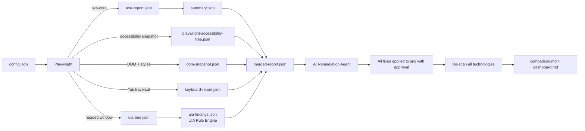
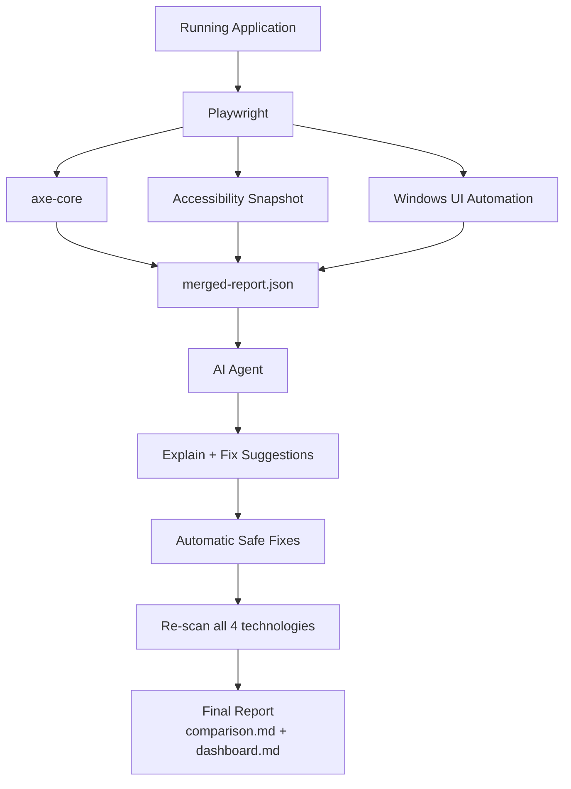

# ADA Harness & AI-Based Accessibility Remediation Agent

A reusable, framework-independent accessibility toolkit that **scans** any running web
application with **four** complementary accessibility technologies, **merges** their
findings into one correlated report, and **remediates** issues with an AI agent that
explains each problem, locates the affected source code, and applies **safe** automatic
fixes.

---

## Objective

This project is made up of **two independent but integrated components**:

| # | Component | Responsibility |
| - | --------- | -------------- |
| 1 | **ADA Harness** | Scans a running web application using **Playwright**, **axe-core**, the **Playwright Accessibility Snapshot**, and **Windows UI Automation**, then merges all findings into `merged-report.json`. |
| 2 | **AI Accessibility Remediation Agent** | Reads `merged-report.json`, identifies the affected source files/components, explains every violation, and generates **safe** code fixes. Unsafe fixes are left for developer review. |

Both modules can be used **together** (scan → merge → fix → re-scan → compare) or
**independently** (scan-only for auditing, or agent-only against a pre-existing report).

> **Key principle:** The harness is **not hardcoded** to any particular application. The
> only project-specific inputs live in **`config.json`** (base URL, routes, login, etc.).
> Everything else works automatically, and the AI agent dynamically analyzes whatever the
> merged report contains — so the **same harness and agent are reusable across any project**
> without changing the core implementation.

---

## Architecture & Technologies

> 📊 For full diagrams (architecture, scan workflow, fix workflow, sequence, and data flow)
> see [ARCHITECTURE.md](ARCHITECTURE.md).

The harness genuinely executes **all four** technologies on every scan:

| # | Technology | Role in the pipeline | Artifact |
| - | ---------- | -------------------- | -------- |
| 1 | **Playwright** | Launches the browser, performs optional login, navigates every configured route, captures screenshots. | (drives all stages) |
| 2 | **axe-core** | WCAG 2.1 AA rule checking, violation detection, severity. | `axe-report.json` → `summary.json` |
| 3 | **Playwright Accessibility Snapshot** | Captures the browser accessibility tree (roles, accessible names, hierarchy, focusability). | `playwright-accessibility-tree.json` |
| 4 | **Windows UI Automation (UIA)** | Validates what Windows Assistive Technologies actually receive by walking the Windows accessibility tree of the live browser window. | `uia-tree.json` |
| 5 | **Full DOM Snapshot** | Captures the serialized DOM + computed style properties (colour, background, font) so visual rules like `color-contrast` can be verified against real DOM facts the accessibility trees cannot expose. | `dom-snapshot.json` |
| 6 | **Keyboard / Tab-order scan** | Simulates a keyboard-only user (presses Tab) to find interactive controls that cannot be reached — WCAG 2.1.1 / 2.4.3. | `keyboard-report.json` |
| 7 | **UIA Rule Engine** | Converts raw UIA properties into meaningful findings (missing names, non-focusable controls, …) via reusable rule objects. | `uia-findings.json` |
| ★ | **Report merger** | Correlates every scanner so each finding shows *who detected it*, *where it was confirmed*, and a **confidence** score. | `merged-report.json` |



---

## Features

### ADA Harness

- Automated accessibility scanning across multiple technologies
- Playwright integration (browser automation, login, navigation, screenshots)
- axe-core integration (industry-standard rule engine)
- **Playwright Accessibility Snapshot** (browser accessibility tree capture)
- **Windows UI Automation** capture (what Windows AT actually receives)
- **Full DOM snapshot** with computed styles (verifies visual rules like contrast)
- **Keyboard / Tab-order scan** (finds controls unreachable by Tab — WCAG 2.1.1)
- **UIA Rule Engine** (turns raw UIA properties into meaningful findings)
- **Merged report** correlating all scanners with a confidence score (`merged-report.json`)
- WCAG 2.0 / 2.1 **A & AA** validation + axe best-practice rules
- JSON report generation (raw axe output + flattened summary + trees + merged)
- Markdown summary + dashboard generation
- Multi-page scanning in a single run
- Fully configurable routes, login, viewport, browser, timeouts, ignored rules
- Framework independent (works with any URL that renders in a browser)

### AI Remediation Agent

- Reads the correlated **`merged-report.json`**
- Explains every violation in plain language
- Maps each violation to the affected source file **and component**
- Reports which scanner detected it and where it was confirmed
- Prioritizes issues (Critical / High / Medium / Low)
- Applies **[AUTO]** fixes directly and **[APPROVE]** fixes (contrast, headings, keyboard) with an approved diff
- Resolves **every** gap (axe + keyboard + UIA) in source
- Learns resolved patterns via a project-independent knowledge base
- Re-runs the full scan after fixes and generates a before/after comparison

---

## Folder Structure

```text
ada-harness/
├── config.json                  # ⭐ THE ONLY project-specific file (baseUrl, routes, login, …)
├── agent/                       # Continuous-learning knowledge base
│   └── knowledge-base.json      # Project-independent record of resolved fix patterns
├── prompts/                     # Reusable Copilot Agent Mode prompt files
│   └── accessibility-fix.prompt.md
├── playwright/                  # Playwright config + the scan spec
│   ├── config.ts                # Loads config.json; exports adaConfig + Playwright config
│   └── accessibility.spec.ts    # Steps 1 & 3 — axe-core scan + accessibility snapshot
├── uia/                         # Windows UI Automation capture (Technology 4)
│   ├── uia_capture.py           # Python UIA walker (reads the Windows a11y tree)
│   └── requirements.txt         # Python dependency: uiautomation
├── reports/                     # All generated artifacts (created/updated on each run)
│   ├── axe-report.json          # Raw, complete axe-core results
│   ├── summary.json             # Flattened, per-element violation summary
│   ├── summary.previous.json    # Snapshot of the prior summary (for diffing)
│   ├── playwright-accessibility-tree.json  # Playwright accessibility snapshot (Tech 3)
│   ├── uia-tree.json            # Windows UI Automation tree (Tech 4)
│   ├── uia-findings.json        # UIA Rule Engine findings (Tech 7)
│   ├── dom-snapshot.json        # Full DOM + computed styles (Tech 5)
│   ├── keyboard-report.json     # Tab-order traversal + keyboard gaps (Tech 6)
│   ├── merged-report.json       # Correlated, cross-scanner report (agent input)
│   ├── comparison.md            # Before/after Markdown comparison
│   ├── dashboard.md             # Human-readable Markdown dashboard
│   ├── fixes.json / fixes.md    # Every gap: applied + suggested (all sources)
│   ├── resolved-issues.json     # Resolved issues (after re-scan)
│   ├── remaining-issues.json    # Remaining + newly introduced issues
│   └── screenshots/             # Per-page screenshots (optional)
├── scripts/                     # TypeScript pipeline (executed with tsx)
│   ├── analyze.ts               # Orchestrates spec → UIA → rule-engine → summary → merge
│   ├── generate-summary.ts      # Flattens axe-report.json into summary.json
│   ├── uia-scan.ts              # Drives a headed browser + runs uia_capture.py
│   ├── uia-rule-engine.ts       # Runs the Rule Engine over uia-tree.json
│   ├── rule-engine/             # Modular, Open/Closed accessibility rules
│   │   ├── types.ts             # AccessibilityRule / FlatUiaElement contracts
│   │   ├── rules.ts             # 15 reusable rule objects + registry
│   │   └── engine.ts            # Evaluator + UIA tree parser
│   ├── merge-report.ts          # Correlates all scanners → merged-report.json
│   ├── auto-fix.ts              # Safe fixes + prioritization; writes fixes.json/md
│   ├── prioritize.ts            # Critical/High/Medium/Low prioritization
│   ├── knowledge-base.ts        # Continuous-learning store
│   ├── compare.ts               # Diffs current vs previous → comparison.md + resolved/remaining
│   ├── dashboard.ts             # Renders dashboard.md (incl. scanner coverage)
│   ├── score.ts                 # Computes accessibility score / severity totals
│   ├── logger.ts                # Small structured console logger
│   └── types.ts                 # Shared TypeScript contracts for all artifacts
├── package.json                 # Scripts & dev dependencies
└── tsconfig.json                # TypeScript compiler configuration
```

### Directory purpose

| Directory / File | Purpose |
| ---------------- | ------- |
| `config.json` | **The only file you normally edit.** All project-specific inputs: baseUrl, browser, viewport, routes, login, screenshots, ignored routes/rules, timeouts, report directory. |
| `agent/knowledge-base.json` | Project-independent knowledge base of resolved fix patterns (continuous learning). |
| `prompts/` | Ready-to-use Copilot Agent Mode prompt files that drive the remediation workflow. |
| The single AI agent | Defined once at `.github/agents/accessibility-fix.agent.md` (VS Code Copilot Agent Mode). |
| `playwright/config.ts` | Loads `config.json`, resolves all artifact paths, and exports both `adaConfig` and the Playwright configuration. Not normally edited. |
| `playwright/accessibility.spec.ts` | The scan itself — login, navigation, axe-core, and the accessibility snapshot. |
| `uia/` | Windows UI Automation capture: a Python script that walks the Windows accessibility tree of the live browser window. |
| `reports/` | Every artifact the harness produces. Safe to delete; regenerated on each run. |
| `scripts/` | The TypeScript pipeline that orchestrates scanning, UIA capture, merging, comparing, and reporting. |
| `package.json` | Defines the `ada` (and `uia` / `merge` / `compare`) entry points and dev dependencies. |
| `tsconfig.json` | Strict TypeScript configuration for the scripts and spec. |

---

## Prerequisites

| Software | Purpose | Notes |
| -------- | ------- | ----- |
| **Node.js** (v18+) | Runtime for the harness and scripts | LTS recommended |
| **npm** | Package manager | Ships with Node.js |
| **VS Code** | Editor + host for the AI agent | Recommended |
| **GitHub Copilot (Agent Mode)** | Runs the AI remediation agent | Required for AI-driven fixes |
| **Playwright** | Browser automation | Installed via npm + `npx playwright install` |
| **axe-core** | Accessibility rule engine | Installed via npm (`@axe-core/playwright`) |
| **Python** (3.8+) | Runs the Windows UI Automation capture | Required for Technology 4 (UIA) |
| **`uiautomation`** (Python pkg) | Reads the Windows accessibility tree | `pip install -r uia/requirements.txt` (Windows only) |

> **Windows UI Automation is Windows-only.** On non-Windows hosts (or when `uiautomation`
> is not installed) the UIA stage still executes and still writes `uia-tree.json`, but it
> records `available: false` so the merge step and the rest of the pipeline continue to work.

---

## Installation

```bash
# 1. Clone the repository that contains the harness
git clone <your-repository-url>

# 2. Move into the harness package
cd ada-harness

# 3. Install dependencies (Playwright, axe-core, tsx, TypeScript, etc.)
npm install

# 4. Download the browser binaries Playwright drives
npx playwright install

# 5. Install the Windows UI Automation dependency (Windows only)
pip install -r uia/requirements.txt
```

**Command explanations**

| Command | What it does |
| ------- | ------------ |
| `git clone <url>` | Downloads the project source to your machine. |
| `cd ada-harness` | Enters the harness package directory. |
| `npm install` | Installs all dependencies listed in `package.json`. |
| `npx playwright install` | Downloads the Chromium/Firefox/WebKit binaries Playwright needs to launch real browsers. |
| `pip install -r uia/requirements.txt` | Installs the `uiautomation` package used by the Windows UI Automation stage. |

---

## Configuration

All project-specific configuration lives in a **single file** —
[`config.json`](config.json). There are **no hardcoded application values** anywhere in the
source. To point the harness at a different application, edit only this file.

```jsonc
{
  "baseUrl": "http://localhost:3000",   // running app URL (override with ADA_BASE_URL)
  "browser": "chromium",                // chromium | firefox | webkit
  "viewport": { "width": 1280, "height": 800 },
  "settleTimeoutMs": 1500,               // wait for hydration before scanning
  "timeouts": { "navigationMs": 30000, "testMs": 60000 },
  "appSrcDir": "../src",                 // source root the agent fixes
  "reportDir": "reports",               // output folder
  "screenshots": { "enabled": true, "dir": "reports/screenshots" },
  "wcagTags": ["wcag2a", "wcag2aa", "wcag21a", "wcag21aa", "best-practice"],
  "ignoredRules": [],                    // axe rule ids to disable
  "routes": [
    { "name": "Home",  "path": "/" },
    { "name": "Login", "path": "/login" }
    // ...add or remove routes here
  ],
  "ignoredRoutes": [],                   // route paths to skip
  "login": {
    "enabled": false,
    "loginPath": "/login",
    "usernameSelector": "#email",
    "passwordSelector": "#password",
    "submitSelector": "button[type=\"submit\"]",
    "usernameEnv": "ADA_LOGIN_USER",     // credentials come from ENV, never hardcoded
    "passwordEnv": "ADA_LOGIN_PASS",
    "waitForSelector": ""
  },
  "uia": {
    "enabled": true,
    "python": "python",
    "maxDepth": 40,
    "windowClass": "Chrome_WidgetWin_1"
  }
}
```

| What you configure | Key | Notes |
| ------------------ | --- | ----- |
| **Base URL** | `baseUrl` | Or set `ADA_BASE_URL` env var (wins over config). |
| **Browser** | `browser` | `chromium` \| `firefox` \| `webkit`. |
| **Viewport** | `viewport` | `{ width, height }`. |
| **Application routes** | `routes` | Array of `{ name, path }`. |
| **Ignored routes** | `ignoredRoutes` | Route paths removed before scanning. |
| **Ignored WCAG rules** | `ignoredRules` | axe rule ids disabled during the scan. |
| **Authentication** | `login` | See [How to Configure Login](#how-to-configure-login). |
| **Screenshots** | `screenshots` | Toggle + output directory. |
| **Report directory** | `reportDir` | Where all artifacts are written. |
| **Source root** | `appSrcDir` | The code the agent applies fixes to. |
| **Timeouts** | `timeouts` | Navigation + per-test timeouts. |

> **Environment overrides:** `ADA_BASE_URL` and `ADA_SETTLE_MS` let CI point the same
> harness at staging/preview deployments without editing `config.json`.

### How to Configure Login

Set `login.enabled` to `true` and provide the selectors for your login form. **Credentials
are never stored in `config.json`** — they are read from the environment variables named by
`usernameEnv` / `passwordEnv`:

```bash
# PowerShell
$env:ADA_LOGIN_USER = "tester@example.com"
$env:ADA_LOGIN_PASS = "<password>"
npm run ada
```

The login flow runs once before any protected route is scanned.

---

## How to Test Any Project

The harness works for **any** web application. Follow this workflow:

### Step 1 — Clone the ADA Harness

```bash
git clone <your-repository-url>
cd ada-harness
npm install
npx playwright install
```

*Expected output:* dependencies installed and browser binaries downloaded.

### Step 2 — Update configuration

Edit [`config.json`](config.json) and set `baseUrl` and `routes` for your application
(plus `login`, `browser`, `viewport`, etc. as needed).

*Expected output:* config now points at your app's URL and routes.

### Step 3 — Start the target application

Start your app so it is reachable at the configured `baseUrl` (for example
`http://localhost:3000`).

*Expected output:* the app responds in a browser at that URL.

### Step 4 — Run a scan

```bash
npm run ada
```

*Expected output:* per-page scan logs; a headed Chromium window briefly opens for the UIA
capture; then `axe-report.json`, `playwright-accessibility-tree.json`, `uia-tree.json`,
`summary.json`, `merged-report.json`, and `dashboard.md` are written to `reports/`.

### Step 5 — Review generated reports

Open [`reports/dashboard.md`](reports/dashboard.md) and
[`reports/merged-report.json`](reports/merged-report.json).

*Expected output:* a list of correlated findings grouped by page and severity, plus a
scanner-coverage summary.

### Step 6 — Remediate with the AI agent, then re-scan

Run the **Accessibility Fix Agent** (Copilot Agent Mode). It reads `merged-report.json`
and fixes **every** gap in your source. Then re-scan and compare:

```bash
npm run ada        # re-scan all technologies
npm run compare    # before/after comparison
```

*Expected output:* the agent edits source to resolve findings; the re-scan + compare write
`comparison.md` plus an updated `dashboard.md`.

### Step 7 — Review the comparison report

Open [`reports/comparison.md`](reports/comparison.md).

*Expected output:* a before/after breakdown showing **fixed**, **remaining**, and **new**
violations.

---

## Reports Generated

| File | Format | Description |
| ---- | ------ | ----------- |
| `axe-report.json` | JSON | Raw, complete axe-core results for every page. |
| `summary.json` | JSON | Flattened, per-element violation summary. |
| `summary.previous.json` | JSON | Snapshot of the prior summary, used for diffing. |
| `playwright-accessibility-tree.json` | JSON | Playwright accessibility snapshot per page (Technology 3). |
| `uia-tree.json` | JSON | Windows UI Automation tree per page (Technology 4). |
| `uia-findings.json` | JSON | Accessibility issues inferred from the UIA tree by the Rule Engine. |
| `dom-snapshot.json` | JSON | Full serialized DOM + computed styles per page (Technology 5). |
| `keyboard-report.json` | JSON | Tab-order traversal + keyboard-access gaps (WCAG 2.1.1 / 2.4.3). |
| `merged-report.json` | JSON | Correlated cross-scanner report — **the AI agent's input**. |
| `comparison.md` | Markdown | Before/after comparison (resolved / remaining / new + score). |
| `dashboard.md` | Markdown | Human-readable overview incl. scanner coverage. |
| `screenshots/` | PNG | Per-page screenshots (when enabled). |

### `summary.json` sample

```json
{
  "generatedAt": "2026-07-28T16:38:48.714Z",
  "baseUrl": "http://localhost:3000",
  "totalViolations": 3,
  "pagesScanned": 7,
  "severityCounts": {
    "critical": 1,
    "serious": 1,
    "moderate": 1,
    "minor": 0
  },
  "violations": [
    {
      "page": "Home",
      "url": "http://localhost:3000/",
      "ruleId": "image-alt",
      "wcagRuleIds": ["wcag2a", "wcag111"],
      "description": "Images must have alternate text",
      "impact": "critical",
      "target": "img.hero-banner",
      "html": "",
      "helpUrl": "https://dequeuniversity.com/rules/axe/4.12/image-alt"
    }
  ]
}
```

| Field | Meaning |
| ----- | ------- |
| `generatedAt` | ISO timestamp of when the summary was produced. |
| `baseUrl` | Base URL that was scanned. |
| `totalViolations` | Total number of flattened violation entries. |
| `pagesScanned` | Count of distinct pages scanned. |
| `severityCounts` | Aggregate totals bucketed by impact. |
| `violations[].page` / `url` | Where the violation was found. |
| `violations[].ruleId` | axe rule id (e.g. `image-alt`, `button-name`). |
| `violations[].wcagRuleIds` | WCAG / best-practice tags for the rule. |
| `violations[].impact` | Severity: `critical` \| `serious` \| `moderate` \| `minor`. |
| `violations[].target` | CSS selector pinpointing the offending element. |
| `violations[].html` | Outer HTML of the offending element (used to locate source). |
| `violations[].helpUrl` | Deque documentation link for the rule. |

### `merged-report.json` sample (the AI agent's input)

Each finding is an axe violation **correlated** against the Playwright accessibility tree
and the Windows UI Automation tree:

```json
{
  "generatedAt": "2026-07-28T16:40:00.000Z",
  "baseUrl": "http://localhost:3000",
  "sources": { "axe": true, "playwrightTree": true, "uia": true },
  "totalFindings": 1,
  "severityCounts": { "critical": 1, "serious": 0, "moderate": 0, "minor": 0 },
  "trees": { "playwrightNodeCount": 412, "uiaNodeCount": 388, "uiaAvailable": true },
  "findings": [
    {
      "page": "Home",
      "ruleId": "image-alt",
      "impact": "critical",
      "target": "img.hero-banner",
      "html": "",
      "wcagRuleIds": ["wcag2a", "wcag111"],
      "helpUrl": "https://dequeuniversity.com/rules/axe/4.12/image-alt",
      "detectedBy": ["axe-core"],
      "verifiedIn": { "playwrightTree": "confirmed", "uia": "confirmed" },
      "correlation": "Confirmed by axe-core, Playwright Accessibility Tree, and Windows UI Automation."
    }
  ]
}
```

| Field | Meaning |
| ----- | ------- |
| `sources` | Which artifacts contributed to the merge. |
| `trees` | Node counts for each accessibility tree + whether UIA ran. |
| `findings[].detectedBy` | Scanners that reported the issue. |
| `findings[].verifiedIn.playwrightTree` | `confirmed` \| `not-detected` \| `not-found` \| `unavailable`. |
| `findings[].verifiedIn.uia` | Same statuses for the Windows UI Automation tree. |
| `findings[].correlation` | Human-readable cross-scanner summary. |

---

## How `merged-report.json` Is Created

1. **axe-core** violations are flattened into `summary.json` (one entry per element).
2. **`merge-report.ts`** loads `summary.json`, `playwright-accessibility-tree.json`, and
   `uia-tree.json`.
3. For each name-related rule (e.g. `image-alt`, `button-name`, `link-name`, `label`), it
   searches the **Playwright tree** and the **UIA tree** for a control of the matching role
   whose accessible name is blank.
4. Each finding records `detectedBy` (axe-core) and `verifiedIn` (whether the same problem
   is `confirmed` in the browser tree and the Windows tree), plus a human-readable
   `correlation` string.

This gives a single, trustworthy source: an axe finding **confirmed** in both the browser
and Windows accessibility trees is a real barrier for assistive technology users.

---

## How Windows UI Automation Is Used

1. `uia-scan.ts` launches a **headed Chromium** window via Playwright and navigates to each
   configured route.
2. For each page it brings the window to the foreground and invokes
   [`uia/uia_capture.py`](uia/uia_capture.py).
3. The Python script attaches to the browser window (matched by Win32 class name + title)
   and walks the **Windows accessibility tree** via the UI Automation API, collecting each
   control's **name**, **role (control type)**, **automation id**, and **hierarchy**.
4. All captures are aggregated into `uia-tree.json`.

This validates what Windows Assistive Technologies (Narrator, JAWS, NVDA) actually receive
— not just what the DOM claims. On non-Windows hosts the stage still runs and writes
`uia-tree.json` with `available: false`.

---

## How the Playwright Accessibility Snapshot Is Used

During the main scan, after axe-core runs on each page, the spec calls
`page.accessibility.snapshot()` to capture the **browser accessibility tree** — roles,
accessible names, values, focusability, and hierarchy — into
`playwright-accessibility-tree.json`. The merge step uses it to confirm whether an axe
finding is also visible in the tree the browser exposes to assistive technology.

---

## How the Full DOM Snapshot Is Used

Accessibility trees expose semantics (roles/names) but **not** visual facts such as colour
or font size — so rules like `color-contrast` cannot be confirmed there. During the scan the
spec captures, per page:

- the **serialized DOM** (`document.documentElement.outerHTML`), and
- the **computed styles** (`color`, `background-color`, `font-size`, `font-weight`, text) of
  every element referenced by an axe finding,

into `dom-snapshot.json`. The merge step attaches these `domProperties` to each finding and
sets `verifiedIn.dom: "confirmed"`, so visual findings are backed by the real DOM. Toggle it
via the `dom` block in `config.json` (`enabled`, `fullHtml`).

---

## How Keyboard Navigation Is Tested

Neither axe-core nor UIA proves a control is actually reachable with the **Tab** key. The
harness simulates a keyboard-only user per page:

1. Tags every visible, enabled interactive element (`a[href]`, `button`, inputs, `select`,
   `[tabindex]`, `role="button"`, …).
2. Blurs focus, then presses **Tab** repeatedly, recording each focused element to build the
   real Tab order (the bound adapts to the number of interactive elements so nothing is
   missed).
3. Any interactive element **never reached by Tab** is a **keyboard-access gap**
   (`keyboard-unreachable`, WCAG 2.1.1). Elements with a positive `tabindex` are flagged too
   (`keyboard-positive-tabindex`, WCAG 2.4.3).

Results are written to `keyboard-report.json` (per-page `tabOrder`, `unreachable`,
`positiveTabindex`) and the findings are merged into `merged-report.json` under
`keyboardFindings`. Configure via the `keyboard` block in `config.json`
(`enabled`, `maxTabs`).

---

## AI Agent Workflow



Plain-text pipeline:

```text
Application
   ↓
Playwright  (browser automation / login / navigation / screenshots)
   ↓
├─ axe-core                       → axe-report.json → summary.json
├─ Accessibility Snapshot         → playwright-accessibility-tree.json
└─ Windows UI Automation          → uia-tree.json
   ↓
Merge (correlate all scanners)    → merged-report.json
   ↓
AI Agent (explain + classify safe/unsafe)
   ↓
Automatic Safe Fixes
   ↓
Re-scan (all 4 technologies)
   ↓
Final Report                      → comparison.md + dashboard.md
```

---

## Safe Fixes

These fixes are **applied automatically** when a single, unambiguous element can be
identified. If the element cannot be confidently located, the fix is downgraded to a
suggestion instead of guessing.

| Rule | Fix |
| ---- | --- |
| Missing `alt` text (`image-alt`) | Add a descriptive `alt` attribute |
| Missing accessible name (`button-name`, `link-name`) | Add `aria-label` or visible text |
| Missing form label (`label`) | Add `<label htmlFor>` or `aria-label` |
| Duplicate `id` | Make the `id` unique |
| Missing button text | Add visible text or `aria-label` |
| Missing `role` attribute | Add the correct `role` |
| Missing `lang` (`html-has-lang`) | Add `lang="en"` to `<html>` |

---

## Unsafe Fixes

These require **human judgment** and are **suggested only** — never modified automatically:

- Keyboard navigation redesign
- Focus management and tab order
- Business logic changes
- ARIA relationships (`aria-controls`, `aria-owns`, etc.)
- Complex UI behavior
- Dynamic content
- Colour contrast and heading/landmark structure

---

## Supported Frameworks

The solution is **framework-independent**. Because it drives a real browser and inspects the
rendered DOM, it works with **any application that runs in a browser**:

- React
- Angular
- Vue
- Next.js
- Plain HTML
- ASP.NET
- Blazor
- **Any web application that renders in a browser**

---

## How to Onboard a New Project

The harness is reusable across projects **without touching any source code**:

1. Copy the `ada-harness/` folder into (or alongside) the target project.
2. Edit **only** [`config.json`](config.json): set `baseUrl`, `routes`, `appSrcDir`, and
   (if needed) `login`, `browser`, `viewport`.
3. `npm install` + `npx playwright install` + `pip install -r uia/requirements.txt`.
4. Start the target app, run `npm run ada` (scan), then run the **Accessibility Fix Agent**
   to remediate every gap.

Because every project-specific value lives in `config.json` and the AI agent reads whatever
is in `merged-report.json`, the **same harness and agent work for any framework**.

---

## How to Extend

| Goal | How |
| ---- | --- |
| **Add more routes** | Add `{ name, path }` entries to `routes` in `config.json`. |
| **Add a login flow** | Set `login.enabled: true` in `config.json` and provide selectors; pass credentials via `ADA_LOGIN_USER` / `ADA_LOGIN_PASS` env vars. |
| **Skip a route** | Add its path to `ignoredRoutes` in `config.json`. |
| **Add custom accessibility rules** | Extend `wcagTags`, or list rule ids in `ignoredRules`, in `config.json`. |
| **Change browser/viewport** | Set `browser` / `viewport` in `config.json`. |
| **Customize reports** | Edit `scripts/dashboard.ts` and `scripts/compare.ts`. |
| **Tune UIA capture** | Adjust `uia.maxDepth` / `uia.windowClass` / `uia.python` in `config.json`. |
| **Focus UIA on the app** | Keep `uia.documentOnly: true` (default) so the Rule Engine skips browser chrome (toolbar/tabs) and only evaluates the web document. || **Integrate into CI/CD** | See [CI/CD Integration](#cicd-integration). |
| **Add additional AI prompts** | Add prompt files under `prompts/` and reference them from `agent/`. |

---

## CI/CD Integration

Run accessibility scans automatically on every pull request.

### GitHub Actions

```yaml
name: Accessibility Scan
on: [pull_request]

jobs:
  ada:
    runs-on: ubuntu-latest
    steps:
      - uses: actions/checkout@v4
      - uses: actions/setup-node@v4
        with:
          node-version: 20
      - name: Install dependencies
        working-directory: ada-harness
        run: npm install
      - name: Install Playwright browsers
        working-directory: ada-harness
        run: npx playwright install --with-deps
      - name: Run accessibility scan
        working-directory: ada-harness
        env:
          ADA_BASE_URL: ${{ vars.ADA_BASE_URL }}
        run: npm run ada
      - name: Upload reports
        uses: actions/upload-artifact@v4
        with:
          name: ada-reports
          path: ada-harness/reports/
```

### Azure DevOps

```yaml
trigger:
  - main

pool:
  vmImage: ubuntu-latest

steps:
  - task: NodeTool@0
    inputs:
      versionSpec: '20.x'
  - script: npm install
    workingDirectory: ada-harness
    displayName: Install dependencies
  - script: npx playwright install --with-deps
    workingDirectory: ada-harness
    displayName: Install Playwright browsers
  - script: npm run ada
    workingDirectory: ada-harness
    env:
      ADA_BASE_URL: $(ADA_BASE_URL)
    displayName: Run accessibility scan
  - task: PublishBuildArtifacts@1
    inputs:
      pathToPublish: ada-harness/reports
      artifactName: ada-reports
```

> **Tip:** Set the `ADA_BASE_URL` variable in your pipeline to point at a preview/staging
> deployment so the same harness works across environments without code changes.

---

## Troubleshooting

| Issue | Likely cause | Solution |
| ----- | ------------ | -------- |
| **Playwright installation errors** | Missing OS dependencies or browser binaries | Run `npx playwright install --with-deps`; on Linux ensure required system libs are present. |
| **Application not reachable** | App not running, or wrong `baseUrl` | Start the target app and confirm `baseUrl` matches the URL you can open in a browser. |
| **No accessibility report generated** | Scan failed before writing artifacts | Check the scan logs; ensure `reportDir` is writable and the app responds within `settleTimeoutMs`. |
| **Authentication issues** | Protected routes redirect to login | Set `login.enabled: true` in `config.json` and provide `ADA_LOGIN_USER` / `ADA_LOGIN_PASS`. |
| **AI Agent cannot locate source files** | Element ambiguity or `appSrcDir` mismatch | Verify `appSrcDir` in `config.json` points at your source root; ambiguous elements are downgraded to suggestions by design. |
| **`uia-tree.json` shows `available: false`** | Not on Windows, or `uiautomation` missing | Run on Windows and `pip install -r uia/requirements.txt`; confirm `uia.python` resolves to your interpreter. |
| **UIA reports "window not found"** | Browser class/title mismatch | Ensure `uia.windowClass` matches your browser (Chromium/Edge = `Chrome_WidgetWin_1`); increase `settleTimeoutMs`. |
| **Slow / flaky results** | Page not fully hydrated before scan | Increase `settleTimeoutMs` (or `ADA_SETTLE_MS`). |

---

## Best Practices

- Use **semantic HTML** first — it removes most violations before scanning.
- **Never suppress** accessibility rules to make a scan pass.
- **Review unsafe AI fixes manually** before merging.
- Run accessibility scans **after every major UI change**.
- Include accessibility testing in your **CI/CD** pipeline.

---

## License

_Placeholder — add your organization's license here (e.g. MIT, Apache-2.0, or an internal license)._

```text
Copyright (c) <year> <organization>
All rights reserved.
```

---

## Important Requirement

This project is intentionally designed for reuse:

- ✅ The **ADA Harness is NOT hardcoded** to any application.
- ✅ The **only** project-specific configuration lives in **`config.json`** (URL, routes,
  login, browser, viewport, etc.).
- ✅ The harness genuinely runs **all four technologies** — Playwright, axe-core, the
  Playwright Accessibility Snapshot, and Windows UI Automation — on every scan.
- ✅ The **AI Agent dynamically analyzes** `merged-report.json` — it is not tied to any
  specific codebase.
- ✅ The **same harness and agent can be reused across multiple projects** (React, Angular,
  Vue, Next.js, Blazor, ASP.NET, static HTML, …) without changing the core implementation.

---

## Testing

See [TESTING.md](TESTING.md) for a complete guide to validating the harness on a sample
project, intentionally introducing accessibility issues, and verifying every artifact
(axe results, accessibility snapshot, UIA tree, merged report, AI fixes, comparison).
